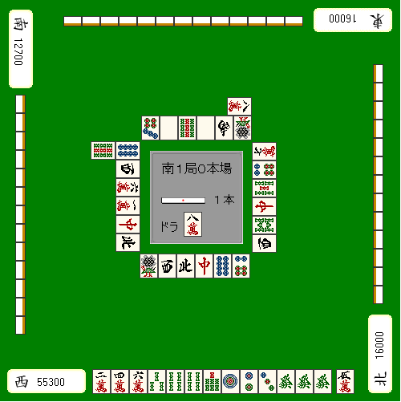

# 麻雀的基础 1—麻雀是？
 今天从最最基础的一章开始，以后会争取每天更新，希望大家多多支持。   1.麻雀是？

 本站以麻将理论为轴心，向读者展示本人自成一派的的麻将战术。其内容也是非常重视实战，而且大量运用了图片使说明，十分容易理解。我们的目标就是将麻将理论体系化。  后文需要了解一些基本的麻将用语才能够继续看下去，如果你是完全的日麻新手，或是初学不久。最好是看看我自己写的详细日本麻将入门教程。磨刀不误砍柴工嘛。  在开始正式的讲座之前，先在本文记述一下我自己的麻将观。

 麻将和运气

 “麻将真的存在‘运势’和‘流势‘吗？” 这是这几年经常议论的一个话题了。 我来说说我的看法吧。  不能说“运气”是麻将最重要的东西。从长远的角度看，运气是时好时坏的，结果还是要归根到实力上，但是又不可能连续的打上 1000 个半庄。 有时能够凑齐 1 次面子，多一点能够凑齐 20 次左右吧。麻将的胜负，大概就是那一天的运气所决定的。纵然麻将也是有实力因素的，但也需要打上个千八百局才能取得一个和自己水平相当的结果。从这个现实的差距来看，也不得不说麻将是有“运气”因素的。  这么说“运势”和“流势”的说法是存在的咯？  我们不能够否定它们的存在。2、3 个半庄你自然能够感觉到你自己是走运还是倒霉。运气好，自己的配牌和牌的进展很顺利；倒霉了，啥都没干就吃了第 4 位这种事情也时有发生。有时候好运和坏运能够持续下去，有时候也会两者互相交替。但是它们之间是没有任何规律的。所以根据自己的“运势”和“流势”来制定战术是否真的有效，此点我深表疑问。  这里有一个例题： 两连胜之后迎来了第三战，这个半庄又摸了一把 6000ALL 的牌。可以说状态是极其的好，但

是这个时候亲家立直了。

 如果你想乘胜追击，切 2 万或者 3 索的话，那你肯定赢不了。  “运气好的话就不会摸到对方要和的牌” “这里弃和的话就失去应有的运势了” 这些只是流势派坚持己见一厢情愿随意编造的理由罢了。用一般常识的想法来考虑，这种点棒状况根本没有与对方决一死战的理由。  拆掉暗刻的“发”才是正确的一招。  即使是流势牌的雀士也有抱着“这里放铳了就会失去现在流势”这样的想法而选择弃和。这是何等有说服力的理由啊= =  “流向”这种东西，是搞不清楚到底会持续到什么时候的。走运也不一定会出现好的结果。骰子连续 3 次都扔出了 1，下一次扔出 1 的概率依旧只有六分之一。要预测“运势”和“流势”是不可能的，人为的想要唤来运气更是痴人说梦。不管前面打的如何的好，也不会有“下一次幸福女神一定会想我微笑”的麻将。

麻将是大体被运气支配的赌博游戏，不能很明显反应自身的实力。即使通过很多努力提高了自身的水平，但你运气不好的时候依旧有可能惨败给水平不如你的对手。这就是麻将了。  运气、运势、流势——全都是神决定的。不走运、流势不好，做什么都是没用的，还是放弃吧。

 麻将的目的

 大部分来看这个博客的朋友都是抱着“想变强”的想法来的吧。说到具体上也就是： *提高麻将的收益 *提升麻将游戏的等级 *获得麻将游戏中的称号 有些朋友也就是为了这些目标才打麻将的吧。  但是，仅仅这些还不是麻将的目的。有的人非常在意 TOP 率，也有的人不在乎成绩而去追求役满等高得点的和牌。

比如这种牌完全可以不和，而切掉 9 万去做大三元。这是其中的一个方案。麻将要根据得与失来选出正确答案，至于怎么打是完全自由，没有局限的。  对麻将的看法因人而异。时常有人批评那些 4 位确定的玩家在 AL 随便和牌，但也请不要把自己的价值观强加于别人，打麻将是不能傲慢的。 在麻将中唯一需要谴责的就是妨碍麻将顺利进行的行为（作弊和拖延行为）而已。 为了避免误会先在这里说明白。这个博客是以“雀力日进”为目的写的。我并没有主张这里所介绍的打法是独一无二的正确答案。  下一章就开始正式的讲座了。