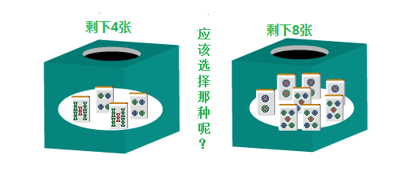

# 麻雀的基础 2—麻雀和概率

麻将和概率：  一说到麻将的做牌，也许有人会去想“到底做那一个役呢？”。 但是我觉得这脱离了麻将的本质。

 做牌的本质是凑齐4组面子+一组雀头， 以一局牌为单位的话，麻将就是比赛4个人中谁能够最快凑齐4组面子+1组雀头的游戏。  虽然最后还是要以得点来评价，但是宝牌多的话（包括赤牌），不需要手役也可以取得高的得点。 这么考虑一下现代麻将的游戏性，果然其本质不是“役”而是“形”。  这么一来，既然只有最快完成“形”的玩家才能加算点数，所以必然对速度有着一定的要求。 那么，到底怎样才能快速地和牌呢？为了解决这个问题的思考方法就叫做牌效率、牌效率的基础就是概率。

 例题1.该切什么好呢？

 考虑一下这个最简单的例子吧。 例1已经完成了3组面子和一组雀头，在凑齐最后一个面子就 OK 了。  切掉1饼，来2、5饼可以和牌。 切掉4饼，来2饼可以和牌。  切那一个更容易和牌是显而易见的。

 例题2.该切什么好呢？

能够让手牌维持听牌（差一张牌就能和牌）状态能够打的牌只有3饼和4饼。 切3饼，听5索和4饼。 切4饼，听2饼和5饼。

不管切什么都有2种听牌，但是他们和牌的容易程度确实是不一样的。  5索和4饼由于自己手牌已经各使用了2张，因此能够和牌的张数只有4张。 而2、5饼则还剩下8张（仅仅从自己的手牌判断）。  用抓阄来打比方的话，也就是能够抽中的纸条更多。 自然张数更多的2、5饼被得到而和牌的概率更高。

 “切牌时应该为了拥有更加有利的进张概率来选择要切的牌”。 这是做牌时最基本的想法。

有时候这里切掉了4饼，不久别人就打出了5索和4饼从而没能够和牌。 但即使是这样，也不要有“要是刚才切3饼就好了”这种想法。 即使打了一手错牌，有时也会有好结局的。这就是麻将啊。  请大家不要在意结果论的一时失败。切记。

 总结，理论

 1.即使是打出了最合适的一手，有时也是会失败的。这就是麻将。 2.不要因为一时成功而喜悦，也不要因为一时的失败而沮丧；要以长远的目光来进行判断。   （待续）