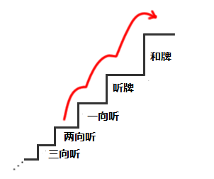

# 麻雀的基础 3—听牌和向听
听牌和向听：  这一章要学习做牌的重要的概念。 比起手役，首先抓住手牌的“形”更加重要。

 麻将的和牌形

 麻将不用我多说，就是以完成和了形为目标的游戏。 和了形可以分为 3 大类。  1.4 面子+一组雀头。 2.7 组不同的对子。 3.国士无双。  2 和 3 是特殊的和了形，1 是最基本的 4 面子形。 而面子又包括顺子和刻子两种。

顺子：  ……同种的连续 3 张数牌一组

刻子： ……同样的 3 张牌一组
 这样，有牌构成的和了形就有如下几种：  1.4 面子+一组雀头。 1-a：四顺子

1-b：三顺子+一刻子

1-c：两顺子+两刻子

1-d：一顺子+3 刻子

1-e：四刻子

 2.七对子

 3.国士无双

 这些和了形的容易程度是有差别的。无疑最难的是国士无双。但是相对的给予的回报也是点数最高的役满。 另外，严密的说，面子中虽然还有 4 张相同的牌组成的杠子，但是这里和刻子没有区别。

 听牌

  还差一张牌就能够完成和了形的状态就叫做听牌。 有役的话就能够和牌了。

有 1 万或者 4 万就能够完成和了形了。  麻将必须要听牌才能够获得点数。而且门前清（没有鸣过牌的状态）听牌的话还可以立直。因此尽快的听牌是非常重要的。

 向听数

 距离听牌还差一手的状态。摸到 1 万、4 万、6 饼就可以听牌了。 像这种还差一张牌有效牌，要是能摸到的话就可以听牌的状态就叫做“一向听” 能够使一向听听牌的进张牌（上面的例子是 1 万、4 万、6 饼）就叫做“听牌机会”。 “听牌机会”的张数越多，听牌也就越容易，也就是更加有利的一向听。

 例 3 的进张数非常的多，有 13 种 42 张牌. 与例 2 的 3 中 12 张牌相比，有了 4 倍的差距啊。 如上面的例子，虽然名字都叫做“一向听”，但是由于牌的组合不一样，听牌的难易度也就有着巨大的差异了。  距离听牌还需要多少手，这个最小回数就叫做“向听数”。  向听数为 1 的牌就叫做“一向听”， 向听数为 2 的牌就叫做“两向听”。 继续下去还有“三向听”、“四向听”。

  这里有个小知识，麻将中距离听牌最远的是“六向听”。

 例 4 是一个六向听的例子，即使是向最短的七对子前进最少也要用上六手呢。  向听数是距离和牌还需要用多少手的一个基准数值，是一个非常重要的考虑方向。 自己的手牌现在是几向听，可以大概的感觉一下。但在一向听或者两向听的时候该怎么打就要与之前明确区别开了。

 降低向听数

 将自己的手牌从两向听变为一向听，一向听变为听牌，听牌在以和牌为目标。这样的打牌意识是非常重要的。

比如这种手牌，常常有人以“它是浮牌”这种理由将 1 万切掉而维持两向听。 要向一向听前进的话就应该切掉 6 万或者 3 饼。

 麻将就像上面的楼梯图一样，需要一个台阶一个台阶的向和牌前进。是绝对不可能跳着前进的。 根据自己的手牌的情况，有时候也不会降低向听数。不过降低向听数是打牌需要考虑的基本问题。  （待续）