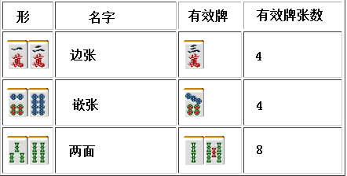

# 麻雀的基础 4—面子和搭子
面子和搭子：

 顺子和刻子

  麻将的和了形必须要4组面子，面子就有顺子和刻子两种选择。

顺子：  ……同种的连续3张数牌一组

刻子： ……同样的3张牌一组
 一般来说，顺子比刻子更容易凑齐。 因为麻将中同一种牌只有 4 张，想要得到其中的 3 张自然不是那么容易的。  但是由于可以鸣牌，吃只能吃上家打出的牌，而碰可以碰任何一家打出的牌。 因此利用鸣牌可以更加容易的凑齐刻子。（但这也不能说刻子比顺子更加容易凑齐）  不鸣牌凭自己的力量摸到的刻子叫做暗刻。由于暗刻比较难以凑齐，即使有三暗刻和四暗刻这种役，也是非常不容易达成的。 所以，面子要以顺子为基本来进行考虑。  总结、理论： 麻将中有顺子和刻子两种面子 顺子比刻子更容易凑齐，因此要以顺子为基础去做牌。

 搭子是？

  再摸到一张牌就能够形成一组顺子的 2 张牌的组合就叫做搭子。 搭子有以下 3 类：

 从上面的表可以看出，两面比边张和嵌张的有效牌多出了一倍，是最好的形。 “制作两面”是做牌基础中的基础。

 边张和嵌张的比较

  让我们来比较一下一眼看下去没有什么差别的边张与嵌张吧。把它们向两面变化就可以看出差距了。  想要把 12 饼变为两面，就必须要摸到 4 饼和 5 饼。

 麻将中需要两手进行变化，可以说是一种令人绝望的概率了。 把边张变为两面几乎没有期待值。  如果是 13 饼的嵌张，只要一手就可以里面变为两面。

 只需要一手的话还是可以值得期待的。  如果是 35 饼这种嵌张的话，摸到 2 饼和 6 饼都可以变成两面。从两面的变化来看，很明显嵌张比边张要有利的多。  另外，在手役方面，边张的听牌形是不会有断幺这个役的。所以要记住：边张是恶形。  总结、理论： 搭子有两面、边张和嵌张 3 种类型。 它们价值的排序如下： 两面>>嵌张>边张 凑出两面是麻将中基础的基础。   （待续）