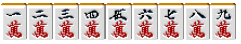
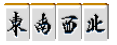
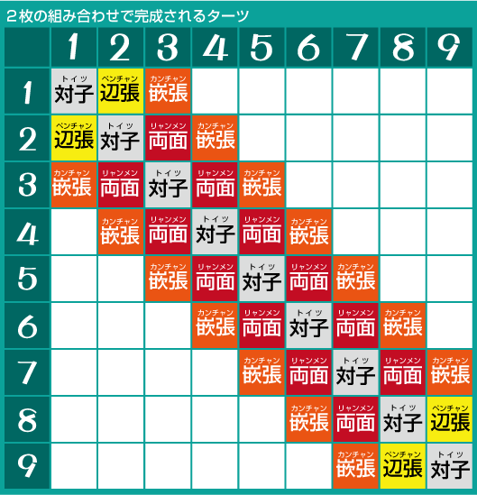
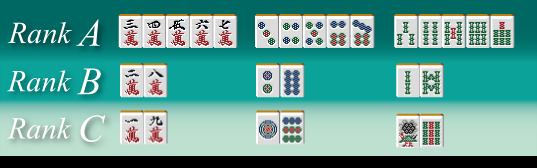

# 麻雀的基础 5—数牌和字牌
数牌和字牌： 日麻中有 34 种牌，我们来看看它们各自有什么作用吧。

 麻将牌的分类

  麻将牌可以按照下面的表来分类：
数牌：

万子：

饼子：

索子：

字牌：

风牌：     三元牌：
 有 1~9 数字的牌只有万子、饼子、索子 3 种，统称数牌。虽然索子有绿一色这个役，但是这三种牌的价值其实是一样的。但是宝牌会使和它同种的所有牌价值有所增加。日本还有只有赤 5 饼的雀庄（注：就是麻将馆），这么一来，饼子无疑就成为了最强的花色。不过这种情况也不用特别在意。  字牌有风牌和三元牌共 7 种。三元牌（白发中）的价值几乎一样（毕竟绿一色出现的概率极低）；风牌会由于自己所坐的位置不同而有时是役牌，有时候不是役牌，这个需要注意。

 关于字牌

  三元牌只要凑齐 3 张一样的就可以形成手役，十分便利。 三元牌的宝牌提示顺序是“白→发→中”的循环关系，可不要搞错了啊。  风牌也有不是役牌的时候。  1.场风牌是役牌 也就是东场的东、南场的南、西场的西、北场的北。 现在一般都玩儿的是东风战和东南战，西和北成为场风的情况几乎没有了。  2.门风牌是役牌 也就是东家的东、南家的南、西家的西、北家的北。 通常也叫做“自风”。 亲家的门风是东、其它 3 人的门风也就确定了。  3.除去场风牌和门风牌，其他的风牌叫做“客风牌”，它们不是役牌。  东场的亲家（东家），南场的南家，同时满足上述 1 和 2 的两个条件的牌叫做“连风牌”，连风牌的役有两翻。 通常叫做“双东”、“双南”，它们作为役牌的价值自然是最高的。  不是役牌的客风牌是最没有价值的字牌。当配牌结束后手牌中只有一张客风牌的话，它将成为第一巡被切的有力候补。

 关于数牌

  数牌有 1~9，但是它们单独一张的时候，各自组成面子的能力有着巨大的差别。  具体看看下面的表就可以明白了。

 数牌的 3~7 可以构成 4 种搭子，其中包括两面和嵌张。  2 和 8 的有效牌就减少到 3 张了，但是能与它形成两面的有效牌就只有 3 和 7.  1 和 9 的有效牌各自就只有 2 张了，而且还都是只能形成边张和嵌张这种愚形。  因此，麻将的数牌可以划分出如下的等级：

 RankA 的 3~7 之间的牌虽然有着微妙的差异，不用管它们之间的差距也足够应付了，没有必要特别注意。只要记住靠近内侧的牌比靠近两端更强就好了。  为什么靠近两端的牌更加弱呢？最根本的原因就是麻将中可以形成 123 和 345 这种面子，但是却不能形成 891 和 912 这种面子。  做面子应该以 3~7 为中心，善于利用靠近内侧的牌形成搭子和面子是做牌的一个诀窍。  总结、理论： 麻将的数牌形成面子的难易度是有巨大差别的 它们的价值排序如下： 3~7>2、8>1、9  （待续）