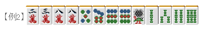
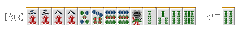

# 麻雀的基础 7—对子（二）

对子（二）：  本节我们来看看作为面子替补的对子。

 对子的性质

  对子有着“当含有两组对子的时候作为面子替补的价值会变高”的性质。 具体的举个例子吧

例 1 是的手牌只有一组对子， 再摸到一张 8 万就会失去雀头，因此其期待值并不高。 即使摸到了 8 万，手牌的向听数还是没有下降。

但是像例 2 这样有两组对子的时候， 对子就用了面子替补的作用。 和例 1 相比，向听进张数增加了 8 万和 9 饼共 4 张牌。  当有两组以上对子的时候，每组对子就会增加 2 张成为刻子的进张数。 这种进张我们通常叫做“双碰进张”。

那么像例 3 这样有 3 组对子的时候该怎么办呢？  每增加一组对子只能增加两张双碰进张。 如果把例 3 的嵌张拆掉的话就会损失 4 张进张数，因此再增加对子是很不利的。  根据牌理考虑的话，这里切掉一张 9 饼是明智的答案。 到底要拆点哪组对子，我们在后面的讲座说明。 这里只要知道有 3 组对子是不利的就好了。  由于每组双碰进张只有 2 张有效牌，当对子有 4 组以上的时候，手牌的进张数会变得很少。 使用“碰”来使手牌前进或者直接做七对子是常有的选择。

 总结、理论： 对子在有两组的时候，有着较强的面子替补作用（双碰进张的效果明显）。 随着对子数量的增加，其面子替补作用会变弱，会越来越难形成面子。   （待续）