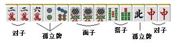
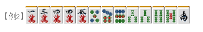

# 麻雀的基础 8—基本形与复合型

基本形与复合型：  到本次讲座位置，我们会接触麻将中所有基本的形。  面子（顺子、刻子） 搭子（两面、边张、嵌张） 对子 孤立牌  麻将的手牌都是有上面四种形构成的。  具体的看个例子吧。

要是拿到例 1 这种牌的话，

可以像上图那样进行分类。  把手牌像上面这样分开进行分析是非常重要的。 为了防止不必要的失误，新手最好是把手牌理顺了之后再打牌。

那么，例 2 这个牌又怎么办呢？ 万子、饼子、索子都是复合型。  我们把它们分割成基本形的时候就会出现问题了。  万子可以看作： 13 万（搭子）、4 万（对子）、5 万（孤张牌）  也可以看作： 345 万（面子）、1 万和 4 万的孤张牌  先不说哪种分析是正确的，我个人十分推荐“就把复合型当作复合型”。  麻将牌的组合会使其派生各种复杂的机能，为了不忽视这些机能的作用，最好是能够了解各种复合型的性质和知识。  复合型的模式是数不清的，想要完全包罗下来是不可能的。但是麻将是越打下去其形就会越强，即使遇到了罕见的形也能够很从容的应对。  后面的讲座将会介绍基本的复合型。  总结、理论： 手牌是由“面子”、“对子”、“搭子”、“孤张牌”所组成的。 由以上两种要素组成的复合型会产生基本形不具有的性质。 了解复合型的各种性质是非常重要的。   （待续）