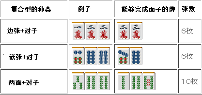
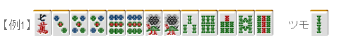

# 麻雀的基础 9—复合型（一）
 复合型（一）：

 三张复合型

  三张复合型只有“对子+搭子”以及“两嵌”两种。

 对子和搭子的复合型

 这种形比对子作用要稍微大一些。 与搭子的其中一张重叠的形，其进张数比仅仅是搭子的进张数多出了可以形成刻子的 2 张。

 即使有这样的形，但很多人会很随便的把对子或者搭子固定下来。固定对子的话会损失 4 张或者 8 张（两面的时候）有效牌；固定搭子的话会损失 2 张或者 4 张的有效牌。

真不明白为什么新手怎么这么喜欢对子。 这种牌一定会有人去切 3 饼，不但损失了 4 饼的进张，同时也否定了饼子将来的好形变化。 也许你会觉得 2 张和 4 张的进张数没什么大不了的。 但在听牌速度是胜负最关键要素的麻将中，单纯的减少进张数很明显是得不偿失的打法。 这里切掉 1 索才是标准的打法。

像例 2 这样的手牌打 7 万在多数情况下都会成为恶手，把现在本来有 16 张进张数减少到 12张是一个很大的损失。 而且这个牌还可以做断幺或者碰听（碰牌之后听牌），

所以只要这里中不是特别危险的话，直接切掉中就好了。  总结、理论： 不要过于早的拆掉对子+搭子的复合型来固定对子或者搭子使进张数尽量多是基本的打法。 要避免在一向听去固定含有不要牌的搭子而损失 4 张进张数的这种情况。

 两嵌

  两个连接起来的嵌张就叫做两嵌。

 两嵌有以上五种形式。 所有的两嵌都有嵌张 2 倍数量的进张数（也就是 8 张）。  由于两嵌拥有和两面一样的进张数（8 张），所以说两嵌是好形。 但是和其他的牌合起来考虑的话，两嵌有时候会变得很不自由。

例 3 这个牌，切掉 2 万是距离听牌最近的一手。但是这样不但放弃了“一气贯通”这个手役的可能性，而且当把索子的面子完成时，听牌形也只能是嵌张了。

例 4 是一个很难的选择，不管你打什么都会有损失。 不管哪一个形都会让你难以下手。  两嵌会消耗 3 张手牌，距听牌越近对手牌的约束就会越大。 当然有时候这也是无法避免的……

总结、理论： 连续的两个嵌张叫做两嵌，是次于两面的好形。在序盘的时候能够发挥作用，但是随着与听牌距离的减少，两嵌会成为与两面相差甚远的坏形。   （待续）