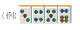
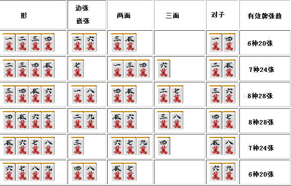
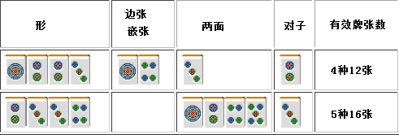
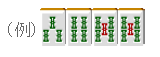
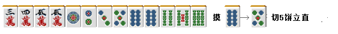
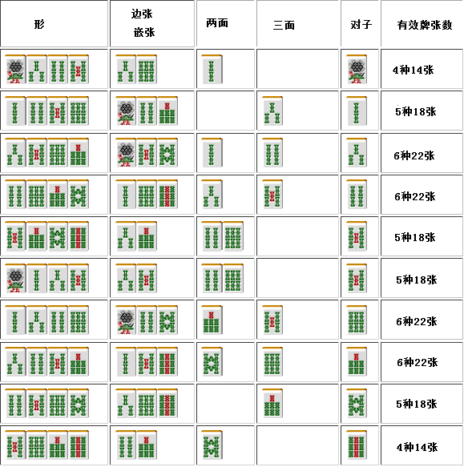

# 麻雀的基础 10—复合型（二）
  复合型（二）：

 四张复合型

  四张复合型有着各种各样的形， 本文选择面子+孤张牌的形式进行研究。 其形包含以下 4 类（这个地方原文写的 5 类，但是根据后面的内容判断，应该是 4 类。），无论哪一类都是非常非常重要的。

 四连形

即连续 4 张数牌的形。 从 1234~6789 一共有 6 组。 把所有的形列出来，看看它们的进张数。

 从上图我们可以看出，四连形和孤立牌一样，也是越靠近内侧进张数就越多。 请记住 3456 和 4567 是麻将 4 张牌组合中进张数最多的。手牌中含有这种形的时候可以当作两个两面看待。  虽然 1234 和 6789 几乎和孤立牌的 4、6 机能一样，但是它们很容易形成雀头，所以拿到也别立马拆了。 可以说四连形是一个好形，应该善加使用。

比如这个牌要是轻率地切掉 3 万把面子固定下来的话，说是一种非常没有效率的打法也不为过。  总结、理论： 四连形的进张数很多， 特别是 3456 和 4567 两种，它们是做成面子效率最高的四张复合型。

 中膨形

即面子中间的的那张牌重叠的形。

1223 和 7889 两种形进张数很狭窄，而且容易形成恶形，所以它们不是很好使用的形。  但与孤立牌的 2、8 相比，它们拥有容易构成一杯口和当形成边张+嵌张时容易做成雀头的优点。 （67889 的话，摸到 5、6、8、9 都可以形成一组面子+雀头）  2334~6778 非常容易形成两面，它们是非常贵重的形。  总结、理论： 2334~6778 都是拥有 4 种牌使之成为一杯口的好形。

 亚两面形

把这种形正式叫做“亚两面形”总感觉有点怪怪的， 这种形也是需要注意的。  １１２３ ２２３４ ３３４５ ４４５６ ２３４４ ５５６７  ３４５５ ６６７８  ４５６６ ５６７７ ６７８８ ７８９９  亚两面形全部有以上十二种组合。  这种形制作两面的能力与孤立牌没有什么太大的差别。 （2234 和孤立牌 2、4566 和孤立牌 6 几乎一样）  但是亚两面形有以下 3 个优点：

1.直接用来听牌

由于是复合型，解决了没有雀头的问题，能够听 6 张。 当然立直也是没有问题的。  2.有转形一杯口的可能性。  3.不规则的三面形转换。

两张 1 饼进张稍微少了一些，这里再摸到一张的话包括雀头在内有三种的进张（这里是 8 万和 1、4 饼）。

 跳一形

对这种形一定要有点意识。 9 万虽然是一张浮牌，但是摸到 8 万的话就可以形成 56789 的两面形。 即使是变成了嵌张，好形变化也会比较多。比单独一张 9 万要好用多了。

（下页附有跳一形的所有组合）

以上是跳一形的所有组合。
让人意外的是，1235 和 5789 由于面子处在两端，其连续形的作用被消弱，和孤张牌的 5
差不多了。
（优点是可以利用“吃”来做成两组面子，否则一定是愚形）

不过这个和 1、9 单独一张相比还是有很大差别的。
1345 的 1 和 5679 的 9 要比单独的 2 和 8 要更加有用。

总结、理论：
跳一形容易形成良形，利用“吃”可以形成 2 组面子。

（待续）