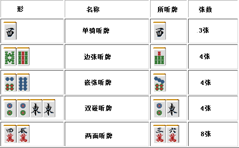
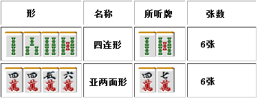
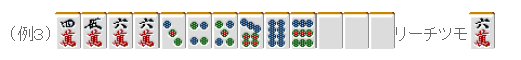
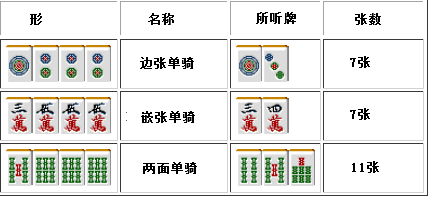
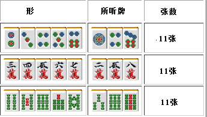
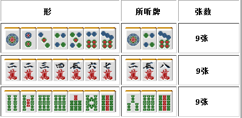
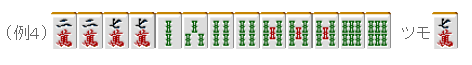

# 麻雀的基础 11—麻将的听牌型（一）

能够和牌的牌我们把它叫做“所听牌”。 麻将中有各种各样的听牌形，但基础的有以下五种。 无论有多少张的听牌数，都是由这五种为基础的。

 基本的听牌型

 从上面的表格可以看出，两面听牌的优势是非常明显的。  单骑听牌一眼看上去虽然糟糕，但是由于其变化多，而且要是听场上已经舍掉的一张字牌的话， 和牌率是非常高的。有时候比听牌数多的听牌更加有效果。  下面来说说实战中经常遇到的听牌形。

 四连形和亚两面形

 四连形可以看作是两个单骑听牌。这个形在形成面子的阶段是超一流的，遗憾的是在听牌时只是很平凡的 6 张听牌。  亚两面形一部分与雀头一体化，比纯粹的两面听牌要少 2 张听牌数。

例 1 和四连形不同，和了之后可以算平和。

例 2 的四连形听牌，不立直的话是不能和牌的。

 另外，亚两面形拥有“可以作为单骑听牌”的特征。

例 3 的情况，把 456 万的面子拆开，形成 6 万的单骑听牌。 单骑 2 符+门清自摸 2 符+幺九牌暗刻 8 符=12 符 切上的话就应该是一个 40 符 3 翻的牌，子家的话就应该是 1300-2600 点。  自摸 3 万的话只能够看作两面听牌，荣和 6 万由于少了 2 符，因此自摸的时候要采取点数更高的计算方法。  麻将有着“高点采用的原则”（手牌要按照点数最高的方法解释）。因此例 3 的牌计算为 30符 3 翻的 1000-2000 点就是错的。虽然不会有什么惩罚，但是这是需要注意的。

 暗刻复合型

 这是在对子（一）已经介绍过的形。 这是以暗刻为轴的不规则听牌，使用频率是相当高的。

 基本三面张

 能够听 3 种牌的听牌形都叫做三面张。 首先介绍一下由两个面子链接起来的基本三面张。

以上 3 种就是所有基本的三面张了。 由它们变化，可以得到含有单骑的三面张：

 由于自己已经使用了 2 张，导致所听牌数减少。 需要注意的自己所听牌也手牌一样也是 147、258、369。  基本的三面听牌和面子组合在一起的时候就有点难于分辨。

例 4 这个牌切掉 5 索是可以形成 3 面听牌好手。 可别太马虎把 2 索或者 4 索切掉了啊。  这个形可以可以形成一杯口，而且和牌的效率也更高。 所以最好是能把这个形记住。  （待续）