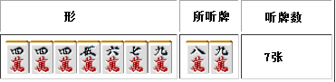
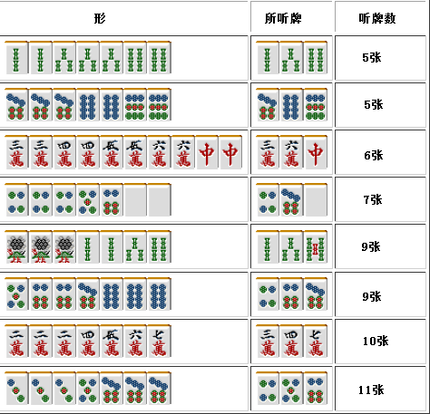
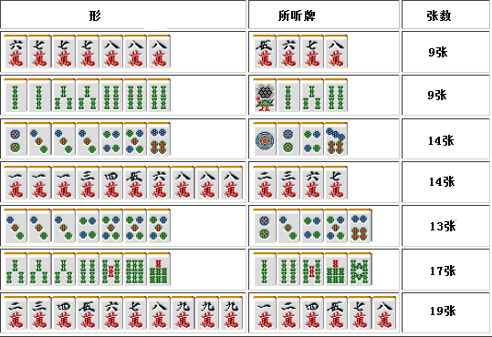
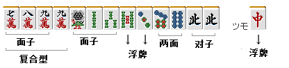

# 麻雀的基础 12—麻将的听牌形（二）

了解不规则多面张听牌的知识，不仅可以在混一色和清一色的情况下派上用场，进攻手段的变化也会增加，是非常有利的。

 不规则两面听牌

上图是不规则两面听的一个比较重要的形，虽然还有其他的不规则两面听，但出现的频率极少，没有记忆的必要。

 不规则三面听

 实战中经常见到的三面听牌应该就是这些了吧。 最上面的两个形很难说是一个好形，还是确定为一杯口会比较有利一些。  下面是在某个揭示板上看到的问题，这个时候我会毫不犹豫地切掉宝牌。

除了 9 索，摸到任何一张索子都可以听牌， 摸到 2 索的话听牌形也许不是太好，要是摸到 6 索或者 7 索的话。就会形成断平两杯口 DORA2的大牌。  我觉得只能这么打啊，但是很多人都会选择切掉 6 索（7 索也是一样的），真有点难以相信呢。

 实战中最好还是了解一些不规则的进张的例子为好。

这个牌本来已经听 4、7 饼了，在这个时候摸到“中”形成了“中”的暗刻。 虽然可以选择切掉 4 饼形成双碰听牌，求自摸三暗刻的打法，但是这里还是切掉 6 饼形成听457 饼才是正确答案。 随意地切掉 3 饼是不能增加听牌数的。

这里要是自摸切掉 1 万的话就未免太马虎了 同样是三面听牌，这里切掉 7 万形成 2、3、6 万的三面听更好。 采用高点法将会有 5200 点的收入。

 四面以上的听牌型

 这里就给出一些例子好了， 还有很多形自己去探索才有意思啊 XD。

 不管是多么复杂的形，应付多面张听牌的基本就是“3 张一样的牌可以看作暗刻，也可以看作雀头+一个单张“。这样基本就可以搞定所有的多面听牌了。

第二章：牌效率
牌效率 1—根据牌理打牌
根据牌理打牌：牌理指的就是为了有效率地完成 4 面子+一组雀头的理论。 这是麻将中做牌的最根本的想法。 和牌理有相同意义的词语就是我们常说的“牌效率”了。  以一局作为单位来说的话 麻将就是比赛“对局 4 人中谁能够最快的组成 4 面子+一组雀头”的游戏。 因此，根据牌理选择切牌（就是打出的牌）是基础。  麻将手牌有“速度”（和牌速度）、“高度”（得点多少）、“防御力”三个要素。 其中“速度”是最重要的。 其中的原因是“速度”能够给予“高度”和“防御力”以掩护。  无论多么大的牌只要和不了就不能增加点棒。 尽早和牌可以阻止对手可能和出的牌，实际的收益也可以看作“和了的点数”+“各种未知的收益”。  而且在对手听牌之前就和牌的话还可以避免放铳。“速度”是手牌的生命线。一定要切记：被手役迷惑双眼而不去和牌是非常不可取的行为。 “华而不实，仅仅是贻误了和牌的巡目而已” 这是漫画“あぶれもん”中的台词，可以说是一局名言了。 前言就说到这里吧，下面来说说根据牌理打牌到底是怎么一回事。

这个手牌会有什么想法呢？ 有全带幺九的机会，要是索子能够上张的话，也可以做三色同顺。 初学者总是容易有“到底应该去做自己记得的那一个役呢？”这种想法。  因此，像这样：

当摸到中的时候，往往会选择切掉 5 索这样的错招。 从 13（14）张手牌的结构方面去考虑是非常重要的。

 手牌的结构如上图，4 面子 1 雀头，我们到底缺什么呢？ 目前已经完成了 2 面子和 1 雀头，把 78 饼算作一个面子的话，我们就还差一组面子了。 既然没有其他的搭子，那么就只能用剩下的 9 万、5 索、3 饼和中来构成了。 那么其中最难组成搭子的一张牌是什么呢？

 像这样去考虑的话，麻将中到底要切什么牌之类的问题不用很纠结就可以给出答案。 分析手牌，用排除法选出应该切掉的牌，然后将这些牌相互比较就可以了。 重要的就是这个“比较”，“比较”的好，就可以将错切大幅减少。  上面这个牌，面子和搭子没有用到的 9 万、5 索、3 饼和中就是应该切掉的候选牌了。 斟酌一下这些牌有着怎样的用处，考虑一下哪一张是最没有用的牌。 将应该切的牌理出，然后反复的比较。这就是麻将的基本——根据牌理打牌。    （待续）