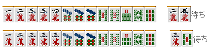
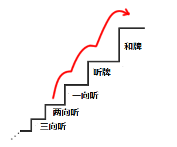

# 牌效率 2—有效牌和张数
 我们都知道麻将需要反复从手牌中选出一张最没用的牌打出。 上一章我说了要最优先和牌的速度来选择切牌是最基本的。 那么，具体要以何种指标来进行选择呢？

 1.张数和概率

例 1 在 3 万没有什么危险的时候一般都选择切 3 万。 我们重新考虑一下，为什么切 1、4 万是错的呢？ 因为切掉 3 万之后我们的听牌型为良性（两面）。

我们实际比较一下吧。

 上图中，上面的牌听的牌有 7 张（3 张 2 万和 4 张 5 万），下面的是 3 张。 当然其他玩家的手里和王牌中也许会含有几张，所以也不能纯粹的说就是 7 张和 3 张。 也有可能山牌中 2、5 万一张都没有了。 但是实际上我们没有办法确定山牌中到底还剩下几张，毕竟我们都不是超能力者。  实战中，7 张和 3 张相比较，听 2、5 万是比较有利的。 “张数越多就越有利”，这是麻将中的一个基本定理。 要是无视这个定理的话可是赢不了牌的。  2、5 万的张数多=2、5 万和牌的概率就高=大多数情况下选择 2、5 万才是正确的 想这样去思考着打麻将是非常重要的。 麻将不是比第六感的游戏，而是比“得失感觉的敏锐性”的游戏。

 2.进张数

 例 1 是已经听牌的情况下比较听牌形。而在没有听牌的情况下比较张数的多少也可以使应该要切的牌变得很明确。

我又把这个图拿出来了。 离和牌还有一段距离的时候，直接考虑通往和牌的最短路程是很困难的。首先是要找到上一个台阶（两向听的话就是到一向听）的最短路程，一步步地尽快地向着和牌迈进。

例 2 是一个两向听的手牌。 把摸到后能够使它成为一向听的牌罗列出来的话就有：1 万、3 万、7 万、4 饼、5 饼、2 索、5 索，一共 7 种 23 张。 这个就是“进入一向听的进张数”。

例 3 和例 2 的牌型差不多，但是例 3 也是七对子的两向听。 所以例 3 的“进入一向听进张数”为：

一共 13 种 35 张。 数量比例 2 多了不少，很明显就能看出例 3 的牌形比例 2 的牌形要好。  我们可以像这样通过数出手牌的进张数来评价一副手牌的好坏。 根据进张数对手牌进行的评价，在后面的讲座中还会遇到几次。

 3.改良

如先前的进张数所示，例 2 的手牌在摸到 4 索之后切 1 索后，向听数虽然没有发生变化。但是却让手牌的进张数增加了。 因此 4 索也不能说不是一张有效牌。  有效牌即是： A：是手牌向听数下降的牌。（进张） B：使手牌的进张数增加的牌。（改良）

例 4 是一个听牌的选择。 现在 2 万、3 饼的双碰和摸到 4 万、后切 2 万听嵌张 3 万的进张数都是 4 张。 这里我们比较一下改良吧：

从上图看出，上面的牌有形成 3 面听的机会。因此这里选择保持双碰才是正确的。 这里采用了一种当进张数相同时去比较改良的方法。不过需要注意的是，相比改良而言，进张数的优势有更高的价值。也就是说进张数应该比改良要优先考虑。 首先考虑进张数是牌效率中的基础。  切记不要将进张数和改良数视为同一个等级，将两种的数量加起来考虑。这点需要注意。   （待续）