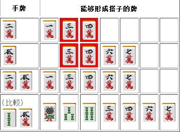

# 牌效率 3—浮牌理论
 麻将中一共有 34 种牌，我们来看看它们各自有什么机能吧。

 1.基本牌理

  34 种牌从对子变成刻子的概率都是一样的。 但是从对子→刻子来说，更加容易鸣牌（容易打出）的字牌和靠近两端的牌比较有利。  而构成顺子的能力越靠近中间则越强。 字牌只能形成刻子。 以门前清为前提的话  【形成面子的能力】： 数牌 3~7>数牌 2、8>数牌 1、9>字牌 可以如上划分一个等级。 越靠近中间的牌就越有利。  字牌则是形成刻子之后有役的牌价值比较高，其价值排序如下： 双东、双南>役牌>客风牌

鸣牌之后能够保证一翻的役牌价值很高，虽然其重要性比老头牌（数牌的 1、9）高的情况很多见 但是场上切出一张之后，其价值就会大大减弱。 要是切出两张的话，就几乎派不上什么用场了。 这个时候拿着的话，几乎都是用作安全牌了吧。

 2.牌的相互作用

  即使是孤立的数牌，当它们相隔 3 的时候也不是那么招人喜欢的。 特别是 14 和 69 这种组合，这里的 1 和 9 是几乎没有什么价值的牌。  14 的进张为 1~6（排除摸 1 的情况，其进张和单独一张 4 一样） 69 的进张为 4~9（排除摸 9 的情况，其进张和单独一张 6 一样） 14 只有在摸到 2356 或者 2335 等情况下形成 2 组面子才能产生作用。  相隔 3 的数牌，我们把它们叫做“筋” “同时拿着筋牌，会导致其一张牌的价值下降”，这是一个定理。  最明显的就是 14 和 69 的组合了。25、36、47、58 同样也会使进张（能够形成搭子的牌的种类）出现反效果。  由于筋牌的进张会有重复，从结果上来看，进张数就减少了。

通过上面的表可以一目了然， 2 万和 5 万有重复的进张 3 万和 4 万，这就变向导致进张数变少了。  25 的情况下，摸到 1 形成 12 边张的话，估计也高兴不起来。 25 的情况应该有摸 3 形成两面的意识。那么当 1 很少（或者没有了）或者 5 是赤牌的时候，

2 的价值就会有所下降了。58 的 8 也是同样的道理。  36 和 47 的话，由于各自牌的价值都还较高，在序盘拿到这种筋牌组合也不用太在意。 但是像下面这个例子的靠张一向听拿着筋牌就是不利的。

这里切掉 7 万的话损失就大了。同时拿着 4 饼和 7 饼会出现筋的反效果。 如果没什么提别的条件的话，这里切掉 7 饼才是正确的。  总结、理论： 拿着筋牌会由于进张牌重复导致进张牌的张数减少。 特别是 14 的 1 和 69 的 9 几乎没有作为面子替补的机能，应该尽早切掉。

 最后来说说相隔 4 的组合吧。 它们是 15、26、37、48、59 这种组合在摸到中间的牌时可以形成一个两嵌，是需要好好利用的。  比如 59 饼摸到 7 饼的话，就可以形成 579 饼的两嵌，但总毫无意义的去这么考虑也是有害的。 59 饼的组合即使没有 9 饼，摸到 7 饼也能够进张。 如果拿 59 饼与 5 饼+9 条相比 59 饼的进张就少了一种。 59 饼切掉 9 饼之后，也只有摸到 78 饼才会导致失败，这里的 9 饼并没有什么特别的意义。  相隔 4 的组合虽然可以形成两嵌，但是也不能说这是十分有利的。 从结果上看，完全没有“向两嵌做牌”这种考虑的必要。   （待续）