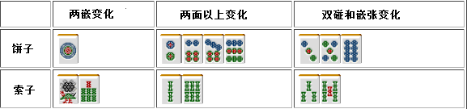

# 牌效率 4—搭子理论（一）

1.基本牌理

 一个搭子的评价要点有以下 5 个： 1.进张数（能够完成面子的牌的数量） 2.改良（变换为两面，三面，两嵌等） 3.打点

4.听牌时是否容易和牌 5.山牌中留下的张数  本次先对最基本的 1、2 两点经行一个评价。  再来看看我在第一张讲到有关搭子之间的一个优劣排序：  两面>两嵌>嵌张>边张

 2.实际的比较

  我们用实战中“面子超载”（其实叫搭子超载才是正确的）的一向听的手牌来进行一个比较吧

由上面搭子优劣的公式来看，这里应该要拆掉 12 饼。

这里也是因为两面>嵌张，所以应该从饼子的嵌张开始切。 但是为了让 5 饼能够成为有效牌，应该从筋牌 2 饼开始切。 要拆掉嵌张搭子的时候，多数情况都是从外到内的顺序切。 但是考虑的牌的危险程度，从内往外切也是可以的。  如果这里要去做三色同顺或者断幺的话，从而破坏手牌切掉 9 饼的话就只能说是一种“例外”了。 这个手牌已经有两组面子+一组雀头，还需要两组面子。那么从“剩下的 3 个搭子哪一个是不需要的”来分析手牌是非常重要的。

同样是嵌张，它们的进张数都是一样的。 我们来比较一下饼子和索子的改良吧。

 这么以比较，饼子比索子更加容易形成好形。所以这里切掉索子是正确答案。 那么 35 索按照什么顺序来切比较好呢？ 从危险度高的 5 索开始切是多数的打法。

嵌张的三种类进行比较，最优秀的就是摸到 7 万可以形成三面的万子嵌张。 饼子和索子相比，索子难以形成两面 所以切掉 9 索是正解。

例 5 是三种两面搭子的比较 从结果上说，这里应该从 3、4 万开始切。 由于万子的两个搭子有重复的进张 5 万。 如果切掉索子的话，则会减少 4 张进张牌。

假设你切掉 4 索之后很走运的摸到了 5 万，形成了一个三面。 但是这么考虑其速度也不及切掉万子。（具体的计算省略= =） 像这样搭子进张重复的情况，我们把它叫做“二度进张”。 一般情况下效率是不高的。  无论切掉万子的哪一个搭子都没什么太大的差别，但是这里由于摸到 6 索的话就有形成三色的希望 因此，这里切掉 3、4 万才是最正确的一手。  这里最差的一手就是为了去做断幺而切 9 索放弃了一向听，

例 6 会弄错的人应该很少。 这里万子因为“二度进张”导致进张狭窄，所以这里该切掉 1 万。  总结、理论： 进张重复的情况我们把它叫做“二度进张” 一般情况下，避免“二度进张”才会有好的效率。   （待续）