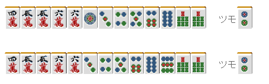

# 牌效率 5—搭子理论（二）

搭子理论（二）：  关于两嵌 两嵌就是像 246 这样由嵌张复合的形。 虽然它的进张数有 8 张，但是 1.需要使用 3 张手牌 2.最终成为听牌形时只能够是嵌张。 从上面两点可以看出，嵌张的机能性还是远远不及两面。

 1.两嵌与双碰

当遇到两嵌的问题是，我们应该选择双碰。  例 1 切掉 3 万有形成平和的概率。 要是摸到 2 万或者 4 万的话就可以听牌了。 相对于切掉 1 万或者 5 万，切掉 3 万的听牌进张数要多一种，看起来选择两嵌才是比较正确的选择。

 但是从听牌效率来看，这里只有切掉 1 万这一手。 因为摸到 2 饼或者 4 饼的时候就会形成完全的平和一向听。

当有雀头可以形成两面的中张牌时， 一般情况下选择“嵌张+双碰”比两嵌的改良要有利一些。

例 2 有三色的机会，大家一定会很想切 8 饼吧。 但是考虑到万子三面的变化，这里切掉 4 饼才是比较好的一手。

例 3 是已经鸣牌的手牌。双碰进张会比较有利。 应该切掉 5 索，让 1 索和 8 索能够碰听。 虽然切掉 1 索形成两嵌进张数没有变化， 但是听牌速度就相差很大了 吃只能吃上家，但是碰是可以碰所有人的。

虽然通常选择双碰是正确的，但凡事也不是都这么的简单。 例 4 切掉 8 万进入一向听寻求改良 有效牌除了 3 万，还有 1 饼。

这里在切掉 4 万或者 8 万，进张数就会增加不少。 如果例 4 切掉 4 万去保留双碰的话，5 万就不能成为有效牌了。  总结、理论： 选择两嵌还是双碰需要比较各自的改良张数。 一般情况下，双碰的更加有利的情况多一些。

 2.容易被忽视的两嵌

 与面子复合的两嵌容易被忽视，这点必须需要注意。

例 5 这样的牌有人会很随意的把摸到的 9 饼切掉。 虽然有形成一杯口的机会， 但是把 567 饼的面子拿开，会有 579 饼的两嵌。 把 9 饼切掉就把 8 饼的进张完全消除了。

例 2 是“一气贯通”的一向听，但是万子含有 246 万的两嵌。 即使是摸到了安全牌也别随便地把 2 万切掉了。 别让放过摸到 3 万就能听牌的机会啊。

 3.不规则两嵌

 以下是很少见的“相离两嵌”。

像这样的形要消耗 6 张手牌，有着 8 张的进张数。

这种形在放弃“一气贯通”的时候经常看到。 例 7 当然是向着门断平和一杯口前进，切 9 饼和切 1 饼就是一个天上一个地下了。 因为后者没有了嵌 2 饼的进张。

  （待续）