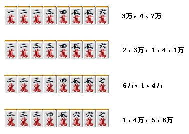

# 牌效率 6—搭子理论（三）

搭子理论（三）：  这次讨论复合搭子的处理方法。

 1.两面+嵌张形

这里就举上图这个例子吧。 这个形不仅有 4、7 索的进张，还有嵌 2 索 这是一个比较常见的形，不要忽视了嵌 2 索的进张哦。

例 1 是一个非常有名的何切问题。 切掉一张 8 万，保留 7 万的进张才是正解。

例 2 这个牌应该切掉 4 饼，形成嵌张+两面的形，留下宝牌进张的可能。 如果宝牌不是 3 饼的话，这里切掉 2 饼留下一杯口的可能性会比较有利。

 2.其他的复合型

例 3 这个牌不做三暗刻和一杯口的话，切掉 6 饼是没有效率的一手。 为了摸到 9 饼也能够听牌，这里应该让自己的手牌进张数多一些。 切 4 万才是最好的一手。

这里切 8 索，是保留了 2 万进张的好手。 如果在摸到 2 万之前索子先构成面子的话，听牌应该就是 58 万了。 与其保留双碰，这里平和的概率要更高。  像这样 8 张的复合型还有以下的组合：

最然它们出现的概率不高，但是它们的进张容易被忽略，这个需要注意。

这里切掉 8 索是进张数最广的一手。 摸到 2、3、5、6 索都可以听牌， 切 4 索或者 6 索的话，进张数就会少 4 张，是很不利的。   （待续）