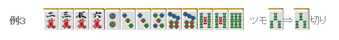

# 牌效率 9—初期牌理（二）

初期牌理（二）：  上一回介绍了通过比较浮牌可以选出切牌的手牌。 这次我们来看看搭子间或者浮牌与搭子的如何比较。

 1.六搭子一雀头形

 这种牌只要单纯地比较搭子就可以了。

根据搭子定理，这里应该从边张搭子开始切。 之后再摸到 3 饼虽然振听了，但是也比切掉 1、3 万要好。 而且这里从外往里切会有不少好处。

这里全是两面搭子，应该切掉有二度进张的索子。 考虑的有三色的机会以及听牌时 69 索比 36 索要好一些，所以这里不能切 78 索。 这里需要注意的是，切掉 1 饼的话就会成为 4 向听。 把唯一的雀头切掉是一定会使向听数增加的。 即使是想做断幺，这里切掉 1 饼只能说是一个恶手。

例 3 全是有二度进张的搭子， 这里去考虑“切这个牌会有什么损失呢？”的话会是非常纠结的。 万子是两面搭子当然要留下。 饼子和索子相比，应该留下 6 饼的进张把摸到的 3 索切掉。  总结、理论： 六搭子形应该把损失最小的那个搭子拆掉。 把手牌中唯一一组雀头拆掉是绝对不可以的。

 2.五搭子+浮牌

 基本的方法就是比较留下的孤立牌即可。

由于万子已经有两个两面搭子，这里 5 万几乎没有什么用处。 以后可能会摸到 2 索或 4 索，所以 3 索有留下的价值。 这里选择切 9 饼的人，没办法，只能说你得了“断幺病”了。 不去做断幺不但可以多 2 种进张牌，而且在一组面子都没有完成的情况下去鸣牌做断幺是很危险的。

这牌可以说有 5 个部分，7 饼的边张和嵌张的二度进张可以说是相当烦人。 有这种恶形搭子的时候，留下孤张牌是非常可取的选择。

例 6 有 369 饼的三度进张，这使得边张的价值变得极其的低。 留下浮牌可以让今后的手牌进行的更加顺利。 由于饼子的进张牌限制太多，去做“一气贯通”是不现实的。  总结、理论： 五搭子形基本上只要把价值最低的那张浮牌切掉就可以了。 有二度进张的边张搭子等不好的搭子的时候， 把搭子拆掉留下浮牌会比较有利。   （待续）