# 牌效率 10—两向听的牌理（一）

两向听的牌理（一）：  首先来看看浮牌比较的情况。 手牌符合已经完成一组面子+一组雀头同时含有 3 个搭子（包括对子）时 拆掉已经完成的面子自然不用说，拆掉手牌唯一的一组雀头会使手牌速度严重下降，是绝对不可以的。 （也就是返回三向听） 首先把要切的浮牌候补选出来，然后进行比较即可。

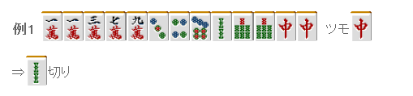

这里 113 万构成了一个搭子的空白， 拆掉这个空白会使进入一向听的进张数减少。 因此这是选择浮牌的一个基础。

单纯地拿 2 索和 7 饼比较的话，毫无疑问应该切掉 2 索。

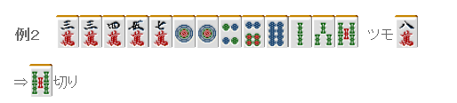

这里应该比较没有形成搭子空白的 3 万和 5 索的价值。 万子有形成连续形的可能，是很不错的。索子由于有 23 索的搭子，这里摸到 4 索就可以进入一向听，所以留着浮牌 5 索也没什么意义。345 的三色只有那么一点点留下的价值。 留下 5 索，摸到 6 索的话会形成 147 索的二度进张，所以索子比万子要差一些。

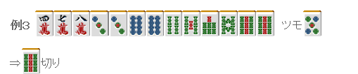

这里应该比较没有形成搭子空白的 4 万和 9 索的价值。 虽说构成了 7899 索的连续形，但是两端的牌形成面子的能力远远不及中间的牌。

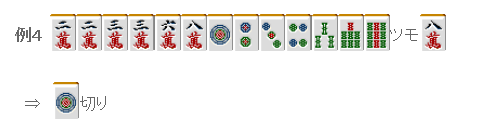

非常微妙的选择。 对子很多，四连形的 1 饼和 4 饼没有什么价值。按照牌理来说，1234 饼和 3 索的价值几乎没有什么差别。 因此这里可以选择手役的差别。 饼子就算做成了两面也无法形成断幺。 索子的话，摸到 2~5 索还有做断幺的可能性。 （注：这里作者的意思是考虑到手役的差别，切掉 1 饼，把 234 饼的面子固定有形成断幺的可能性。）  目前为止都是讨论的浮牌的选择， 那么也是有拆掉搭子的情况的。

像例 5 这样的 3 对子形，不留下双碰进张也是可以的。 虽然 7 万和 6 饼是浮牌，但是这里最好是把两个都留下切 3 万。 不惜损失一张进张牌，留下改良的机会会比较好。  另外，就算是机能差的牌有时候也应该留下。

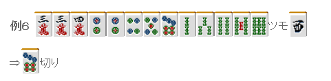

遇到像例 6 这样已经把两面搭子集齐的情况时 把 7 饼留着也不能形成比现在搭子更强的搭子了。 这样的话，就应该把将来可能会有危险的 7 饼先切掉。  总结、理论： 一面子+一雀头+3 搭子的两向听，选择残留浮牌中最没用的是基本。 根据手牌不同，把 3 张一组的搭子变成 2 张一组的单独搭子，去留下浮牌会比较有利。 这种情况几乎都是把 3 对子形中的其中一个对子变成两面。
牌效率 11—两向听的牌理（二）

两向听的牌理（二）：  这次来看看已经完成一组面子并且有 4 组搭子的情况。 没有浮牌的时候，我们有两种选择： 1.拆掉机能最差的一组搭子。 2.把多张的搭子变为单独的搭子，维持 4 搭子。  根据最近的研究，方法 1 是比较给力的打法。 本讲座就以方法 1 为基础进行讲解。  下面来看看实际的手牌吧。

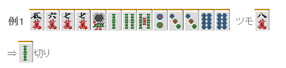

这里索子有 3 索的二度进张，因此应该果断拆掉 12 索的搭子。 切 3 饼会使进入一向听的进张数变少，是恶手。

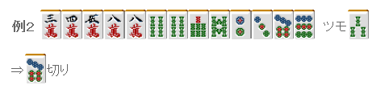

嵌 8 饼的进张数是 4 张，8 万和 4 索的双碰进张也是 4 张。 同样是 4 张的话，为了能够形成平和，切 4 索不是更好吗？ 在古老的战术书中确实切 4 索是正解。 但是进入一向听之后差别就出现了。
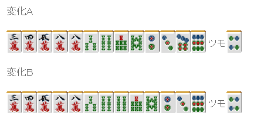

很明显下面的一向听更为有利。 4 索也会成为有效牌饼发挥一定的作用。 这里只能拆掉 79 饼的搭子。 而且拆掉嵌张搭子还有其他好处，可以多一张安全牌。 这里再摸到 6 万、7 万、9 万、7 索、8 索、2 饼、3 饼的话一向听的进张数将会变得更加宽广。

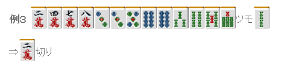

按照“拆掉机能最弱的一组搭子”的想法的话，饼子算上双碰进张有 8 张的进张数，因此要留下。 比较一下万子和索子的嵌张。 还是索子的嵌张更加容易变化成两面， 这里要是再摸到 5 万的话会形成二度进张，所以这个时候还是应该拆掉万子的搭子。

明白“拆掉机能最弱的一组搭子”这个道理的话，这个手牌应该不会纠结的。 比较一下对子的改良种类。 2 饼摸到 3 饼的话会形成三面，147 饼会成为有效牌。 进张数只有两张的单独对子 1 索是机能最弱的。 切掉 1 索才是正解。 这里摸到的不是 6 索而是 7 索的话，切掉 1 索也是最正确的。 但是实战中也有很难比较的搭子的情况。

这里万子和饼子的嵌张很难比较 虽然切哪边都无所谓 不过这里切 2 索保留判断是比较给力的一手。 实战中这牌拆掉嵌张搭子对听牌速度的影响也就那么一点点 但是之后可以根据 8 万和 8 饼那一边比较薄来采取相应的对策。 将来有可能形成 14 索听牌，这里切掉 2 索对于 1 索听牌的是有好处的。 因此这里切 2 索也不坏。  总结、理论： 完成了一面字+一雀头+4 搭子的两向听，没有浮牌的时候拆掉机能最弱的搭子是基本。 但是在很难判断的情况下（没有明显机能弱小的搭子），可以先把手牌中的两面搭子先进行固定来扩大自己判断空间。

牌效率 12—两向听的牌理（三）

两向听的牌理（三）： 目前为止我介绍的两种模式都是不容易达成目的的手牌。

 1.4 搭子+浮牌

 这种情况留不留下浮牌是关键。
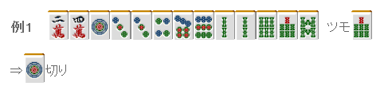

例 1 中明显有 13 饼这个比较弱的搭子， 有能够形成连续形的机会，浮牌 7 索应该毫不犹豫的留下。 去做打点不错的断幺平和一杯口才是更加有魅力的打法。

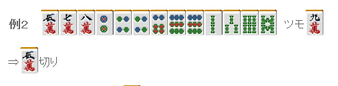

但是例子 2 就比较微妙了，虽然切 4 饼是比较有力的一手， 由于这里想要做什么大的手役很困难，因此直接切掉 5 万 进入两向听，把一向听进张数最大化是比较好的。
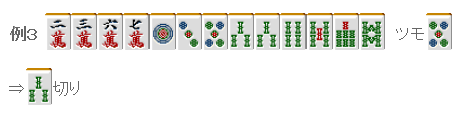

例 3 已经有 3 组两面搭子了，这里已经没有去做两面搭子的必要了。 因此切掉 3 索，同时也还能够为摸到概率比较低的 2 饼做准备。

2.无雀头形

 无雀头形的选择很多时候会很困难。
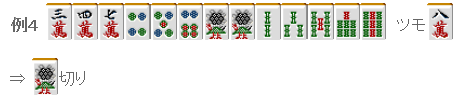

虽说切 9 索也不坏， 不过从听牌速度来看应该以面子优先，切 1 索更有利。  能够进入一向听的张数： 切 1 索会损失 1、4 索的 6 张， 切 9 索会损失 8、9 索的 7 张  虽然这看起来没什么太大差别， 切掉 1 索的话，摸到 4 索会成为非常有效的一张牌。 另外摸到 3、4、7、8 万，万子形成雀头时去拆掉索子嵌张的时候会损失 4 张听牌机会，这里差别是很大的。
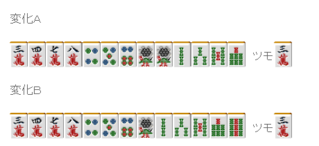

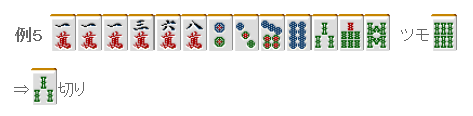

3 万和 3 索相比较 摸到 2 万的时候可以进入一向听， 摸到 2 索还是两向听

虽然有些微弱的差距，但是万子能形成连续形，还是留下比较好。
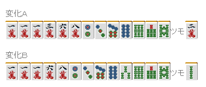

 3.七对子相关

 七对子的两向听，也就是说 4 对子形。
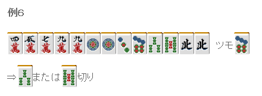

 面子手来说是三向听，七对子是两向听。 因此这里不能对对子下手。 一般情况下是留下对子和面子的复合型，圆滑地向面子手前进。

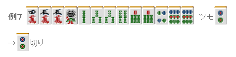

面子手和七对子都是两向听的时候是容易迷茫的地方。 由于这里没有确定平和， 这里切掉 2 饼，留下七对子的可能性比较好。

这里已经全是两面搭子了，切掉对子的 9 饼做平和是没有问题的。   （待续）