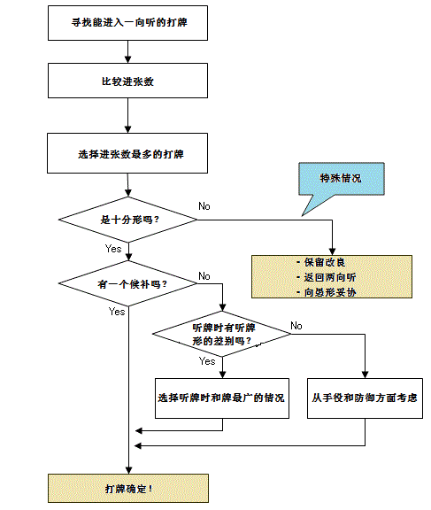
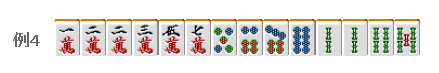

# 牌效率 13—一向听的牌理（一）

一向听的牌理（一）：  一向听的牌理，是做牌中最重要的技术。 原因是其对和牌率有着很深的影响。  不能说对于“无论怎么打都和不了的牌”就能多少有一些效率低下的切牌， 在和牌前的失误有时会是致命的。

 1.基本的思考方法

 最好是能够像下图一样进行打牌的选择：
                          （图见下页）

 从上向下看，菱形方块是分支点。比较困难的是“特殊情况”，其中包括“选择了进张数最广的切牌也不是最好的情况”。

 2.基本情况

 十分形的基准比较难， 要我看的话，进张数在 16 以上的话就可以看作十分形了。 也许有点过分期望了，但即使有 16 张的进张数，到听牌平均也要花上 7~8 巡。 （想知道如何计算的请看别的网站） 想想 1 局也就 18 巡，这个标准已经是很极限了。

切 6 饼一向听的进张数是 16 张。就把这个当作合格点吧。 明显把索子先凑齐会形成愚形听牌。但也不能切掉万子去减少 4 张进张数。 能够让进张数达到最大的切牌有 2 种以上时，或者只有 1~2 张差别的时候， 比较一下它们之间是否有听牌形的差距。

这里切 5 万和 6 索都有 16 张的进张数的一向听，比较一下听牌形的差别。 为了容易形成两面听牌，这里应该切 6 索。

这是一个十分形，进张数和听牌形都没什么差别。 为了能够做三色，应该把 8 索留下 这前面的都没什么难度吧。

 3.非十分形

进张数只有 12 张，是非十分形。 这里首先考虑的是改良。 浮牌 2 万和饼子的连续形形成两面的能力完全不能比。 例 4 只有切 2 万一手。

例 5 是一个“进入一向听呢？”还是“返回两向听？”的选择。 这里我想要避开自己已经使用了一张的 3 饼听牌。  由于断幺、平和等手役（得点力）和立直之后的和牌率（失点的防御力）等影响， 不一定进入一向听就是有利的，这也是麻将的一个难点啊。  这里我觉得切 2 饼比较好。  接下来我根据我的想法来彻底地对一向听的牌理进行一个讨论。   （待续）