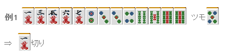
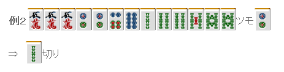
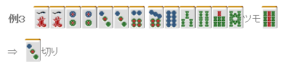
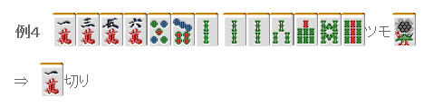
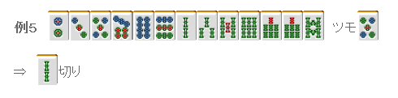
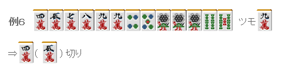

# 牌效率 14—一向听的牌理（二）

一向听的牌理（二）：  首先来说说面子超载形。 运用目前为止说到的知识的话，都能够打出正确的一手了。

 两面听牌比嵌张听牌更有利，这是常识。 摸到 4 万能够形成三面，所以这里从 1 万→3 万这样切。

两个嵌张的比较， 3 索有二度进张，切 2 索。

去做一杯口进张数太少，从打点来考虑也是不利的。 这里还是要避开二度进张的 1、4 饼才是正解。

都有相同的进张数（12 张），听牌形也是相同的嵌张。 那么改良的张数怎么样呢？ 万子的改良只有摸到 5 万的情况。 饼子的话有 3、4、8、9 饼，十分丰富。 （双碰等同样变化除外） 嵌 2 万和嵌 6 饼虽然有听牌的差别， 但是从变化的角度看，这里切掉万子才是正统的打法。

同样都是两面搭子的选择。 由于自己已经使用了 1 张 6 索，很容易忽略这个对 78 索的搭子是不利的。 切掉 2 索，把索子变为“一面子+两嵌”的形式。

一眼看上去，切万子索子饼子都可以。 但是切掉万子的话还可以摸到 6 万这个失张有效牌。（注：原文是裏目，意思是自己已经损失的进张。这里切 45 万，会损失掉 6 万这个进张，因此 6 万就是一个裏目，以后译为失张）

如果没有什么场面上的差别的话，这里切掉 4、5 万才是正确的。 忽略一些细小的地方虽然没什么关系，但一定要有回手摸失张的这个意识。    （待续）