# 牌效率 15—一向听的牌理（三）

一向听的牌理（三）：  我们来验证剩下 2 个搭子的一向听。

这是剩下两个两面的很舒服的一向听。 这种牌应该要留下双碰进张的听牌可能性。

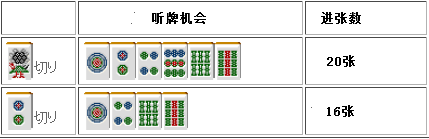

 虽然索子的四连形有“一气贯通”的可能性， 但是从打点方面考虑也是不可行的打法。  如果双碰进张已经很薄的话，用安全牌进行替换会比较好。

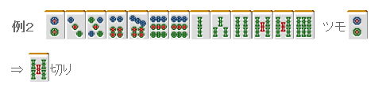

 不管是切 2 饼还是 5 索，听牌的进张数都是 23 张。 这里来比较一下听牌时的情况。
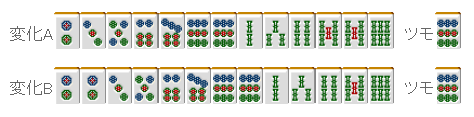

 正好双碰进张的时候，前面切掉了 5 索的话，这里可以形成三面听牌。 虽然是很细小的差别，由于这个是实战中经常遇到的形，打法可以机械一点。

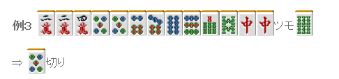

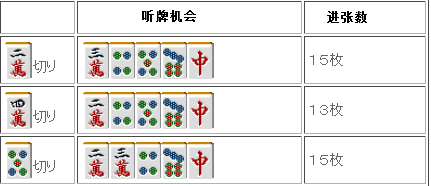

 切 2 万和 5 饼都是 15 张进张，和例 2 一样，双碰进张听牌时能够形成两面。 所以这里切 5 饼更有利。  跟着感觉走把 2 万切掉还可以理解， 但是实战中很多初学者这里会切 4 万。 因此把这个例子当作理论记住吧。  理论、总结： 留下双碰和弱搭子进张会更广。

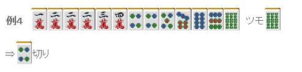

这是包含不规则三面的手牌。 留下边张会多一张进张数，对手役和防守方面也是有利的。
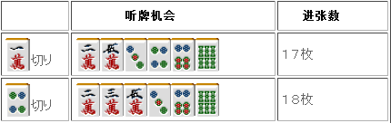

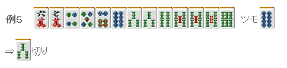

把索子变成“不规则三面+两面”进张是最广的。还是放弃一杯口吧。
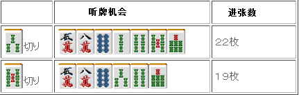

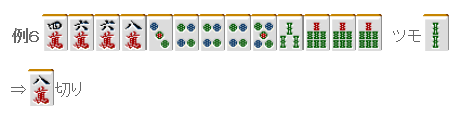

只考虑进张数的话，切 6 万会比切 8 万多一张。 如果只有 1 张的差距的话，这里考虑改良还是切掉 8 万比较好。 像下面这样摸到饼子的话就会很理想。 比起两嵌，双碰是更加柔软的形。
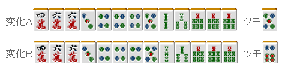

 总结、理论： 只有 1~2 张进张数差别的时候，应该优先考虑改良和听牌时的听牌形。
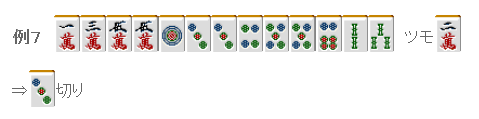

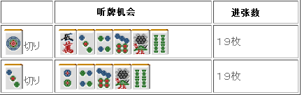

 这是“双碰+两面”和“嵌张+两面”的比较。

这两种形在进张数和听牌形上没有差别，但在手役方面却有差别。  例 7 摸到 2 饼可以做平和三色，所以这里要切 3 饼。

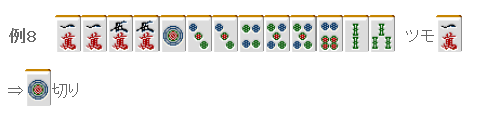

例 8 没发做平和，但却有一杯口。 首先切掉 1 饼。 摸到 5 饼的的话，手牌会更广，这也是一个有利的地方。

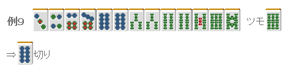

这里别手滑切掉了 8 索。 这里去凹两杯口是恶手啊。 保留嵌 7 索的进张，这里应该切掉 8 饼。  本文虽然罗列出了能够进入听牌的所有牌， 但在实战中没有必要这么做。 能够快速判断出差别是非常重要的。   （待续）