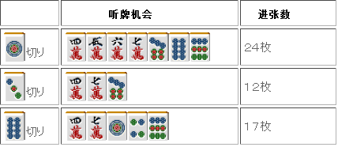

# 牌效率 16—一向听的牌理（四）

一向听的牌理（四）：  本次讲解关于无雀头形的一向听。  要说结论的话，这种形： 不固定雀头，保持“搭子+搭子”的形是进张最广的。

特别是有暗刻和复合搭子的时候 毫无疑问应该向这方面做牌。

 上图列出了例 1 的听牌机会和张数， 切掉 1 索是绝对有利的，也能够保证听牌时保持两面听牌，这个牌没什么好说的。

 这是其中有一个愚形搭子的情况。 这种情况拆掉愚形搭子也是有力的一手。 虽然留下两个搭子进张更广，

但是索子先进张的话，这里只能形成嵌 6 饼的愚形听牌了。  这里切 5 饼的话也许拖延听牌的时机， 但是之后能够形成良形听牌。  如果拆掉愚形搭子的话，之后的变化能够让手牌变成更加容易和牌的形。

这种形是有 7 种 25 张进张的一向听，听牌机会也回到了“搭子+搭子”的形。 虽然不是每次都能够变化的这么顺利，如果巡目允许的话，拆掉嵌张寻求良形听牌也是可以考虑的。  如果是急于听牌的话， 这里还是把切 1 索这一手记入脑中吧。 实战中能够允许贻误听牌时机的情况也不多见。

最后是剩下两个愚形搭子的无雀头一向听。

 这种情况的话，就应该放弃良形听牌了。 这种牌想要赶上良形立直的话还是不要想了。  切掉听牌机会最多的 1 索是最好的选择。 首先瞄准听牌。听牌之后再考虑是立直进攻，还是保持默听摸到危险牌就缩。  以上就是有暗刻的情况，

经过此番研究之后可以断言：  有暗刻的无雀头形+两搭子的向听，把雀头固定下来是绝对不可取的。

比如例 3 切掉 2 索把雀头固定绝对是恶手， 切 2 索和切 3 万的进张数可是天壤之别啊。  总结、理论： 相比把雀头固定下来，不固定雀头的听牌机会要更多。

  手牌中没有暗刻的情况，剩下两个搭子有可能会形成单骑听牌，这是一个让人担心的地方。

切 1 索依旧有着压倒性的听牌优势。 但是这里摸到 4、7 饼和 5、8 索的话就会形成单骑听牌了。 28 张进张牌中，能够形成两面听牌的只有 5、6 饼和 6、7 索 12 张。  相对而言，这里把雀头固定下来还能够确定两面听牌， 而且还可以保证平和，在打点方面也有优势。 切 6 索最后可能形成 1、4 索听牌，比 5、8 听牌要少了 2 张。 那怕是少 1 张，这里也还是切 3 索比较有利。  这个牌切 1 索还是 3 索，人们也是看法不一。 我个人还是觉得切 1 索更加有利， 即使是单骑听牌，再变化一下就好了。

这种平和形到底固不固定雀头仍旧是一个没有结论的问题， 这里根据自己的感觉走也没有关系。  但是，当搭子是复合两面的时候，不确定雀头才是更加有利的。 下面就是一个典型的样本。

听牌机会的数量差距很大。 不仅如此，摸到 5、8 索切掉 5 万可以确定平和听牌。 33 张牌中有 26 张牌能够形成良形听牌，这里很明显应该切掉 1 索。

有一个搭子是愚形的情况。 这种情况拆掉愚形搭子是有力的一手。

 单从听牌机会来看，这里切掉 1 饼更有利。 但是切掉 8 饼有“形成良形听牌、平和率增加、更容易改良”3 个优势。

 特别是例 6 中相连的索子，很容易改良。

最重要的是看透“是否有推迟听牌的空闲”的能力。 如果是接近终盘的话，比起和牌，得到听牌罚符显得更加重要。 有更多的听牌机会会更加有利。  了解每种切牌的优点和缺点， 根据场况打出最合适的一手才是最好的。

最后是有两个愚形的情况。 从听牌速度上看，这里依旧是应该切掉 1 饼。   （待续）