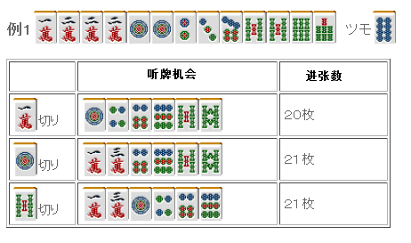
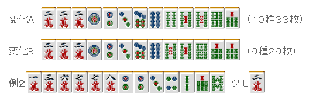
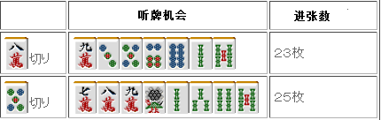
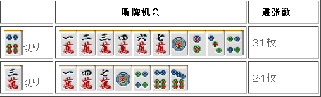
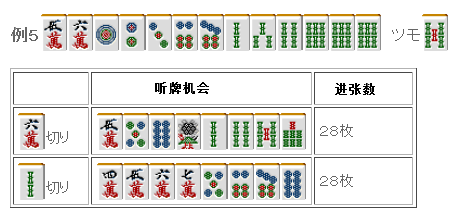

# 牌效率 17—一向听的牌理（五）

一向听的牌理（五）：  本次继续讨论无雀头形。  我们知道了保持“搭子+搭子”的形是进张数最广的。 那么，当像例 1 那样只有一个搭子的时候怎么办呢？

从上面的图看，几乎没有什么差别。 这里摸到 3 万是唯一能形成平和的牌， 最后形成 1、3 万听牌也比 1、4 饼 5、8 索要有利 因此切 1 万明显是很糟糕的，应该留下。  那么 1 饼和 5 索，到底切哪个比较有利呢？ 由于两者的进张数是一样的，比较改良就是基本了。  留下处于内侧的 5 索，可以期待发生如下图 A 和 B 的变化。 因此留下内侧的亚两面形比较有利。

 无雀头形的牌，改良是非常重要的一个要素。 像例 2 这样的牌，很多人都会选择切掉 7 万。 目前一张进张牌不是什么太大的问题，但是由于万子是连续形，必须考虑到是很难形成“搭子+搭子”形的。  例 2 中切掉 7 万的进张数是 5 种 17 张。 但是却放弃了下图 A 和 B 的两种变化，这是多么沉重的损失啊。

目前为止我们都是以听牌为最优先的。 不过最终的听牌形好坏程度也是必须考虑的。

 不用说，保持“搭子+搭子”是进张数最广的。 饼子有四面张，从结果上导致切 5 饼比切 8 万多了两张进张牌。  但是，边 7 万听牌是很痛苦的啊。 果断拆掉 8、9 万才能让听牌速度提高。

例 4 是一个微妙的选择啊。

 一定要保证两面听牌的话，这里切 3 万比较好，

但我个人觉得为了能尽快听牌（多出情况下也是这样），切 6 饼比较好。

最后来看看“五面张形”+“两个两面搭子”的比较。 听牌机会可谓不相上下， 听牌立直的时候应该考虑五面张的部分。  例 5 拆掉 5、6 万和 6、7 饼都是可以的。 平和听牌的时候还可以多一种进张牌。  总结、理论： 比较进张数是基本，当进张数几乎没什么差别的时候，“听牌形”和“改良”就有考虑的必要了。   （待续）