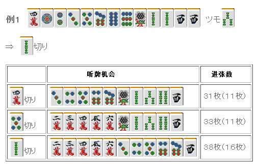
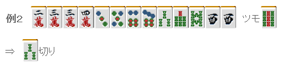
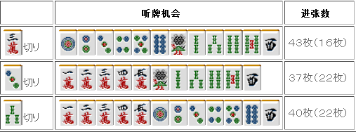
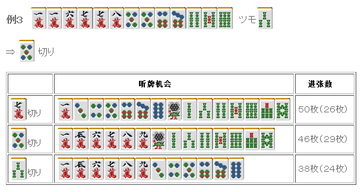

# 牌效率 18—一向听的牌理（六）

一向听的牌理（六）：  靠张的一向听有着： 1.进张数非常广。 2.也很容易形成愚形听牌。 这两个特征。

例 1 是最简单的靠张一向听， 单纯地看靠张的话，根据牌理 3~7>2、8>1、9 的优先度留下应该留下的牌。  所以这里切掉 2S 是没什么问题的。  但是这里即使切掉了效率不高的 4 万或者 5 饼进张数仍然有 30 张以上。 两个两面的一向听进张数也就只有 4 种 16 张， 这也就能够看出靠张一向听到听牌是非常近的。  但是例 1 只是很简单的靠张情况。  靠张一向听能够形成良形听牌的进张很少，切掉 2 索也只有 16 张。  靠张应该重视的是形成良形听牌的进张数。 听牌的进张数有 30 多张已经很充足了。 把 30 张变成 31 张几乎没什么影响。  靠张形听牌的时候应该考虑听牌形或者是手役， 从数目不多的机会下手。

例 2 是一个典型的例子。听牌机会如下图：

 从听牌机会来看，这里应该切掉 3 万 但是能形成良形听牌的切法反而是 3 索=3 饼>3 万， 所以这里切 3 索才是正确的。  3 索和 3 饼之间的比较可以从听牌机会看出，留下 3 饼能够摸到 4 饼形成 3 面张。  例 2 都是数牌“3”的靠张， “数字相同的数牌，形成了连续形的靠张比单独的靠张总体要更强”，把这个记住就好。

索子有连续形中最强的四连形，因此一定要留下。 切 7 万和切 5 饼虽然有点微妙，但是 46 张进张已经足够了， 而且有 29 张能够形成良形听牌，这里当然是切 5 饼了。 万子的中膨形很容易形成两面听牌，这是很有诱惑力的。 连续形的强大之处在前面的讲座已经说明过了，要全部例举出来也是不现实的。  总结、理论：

由于靠张一向听的进张数非常的广， 所以能形成良形听牌的进张数是最应该重视的要素。

 当靠张有愚形听牌时，不去听牌也是有力的选择。 比如这种情况：

怎么都觉得这种双碰听牌让人不爽。 靠张的听牌机会很多，即使放弃听牌也能够再接下来几巡复活。 所以这里果断摸切 7 万，等待下一巡的摸牌吧。   （待续）