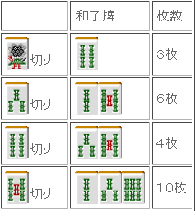
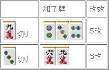
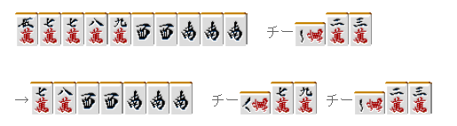

# 牌效率 19—听牌时的牌理

听牌时的牌理：  听牌时没有选择的情况比较多， 但是在有所选择的时候，选择最容易和牌的情况是基本。

 1.听牌的张数

 听牌的张数越多就越容易和牌， 选择听牌张数多的听牌是理所当然的。

 例 1 有 4 个听牌选择。

 这样统一来看，这里就很容易就明白应该切 5 索。 但是不熟悉多面张的时候，很容易随便的选择双碰听牌。 千万别把三面张错过了。 只要把形记住，这种程度的牌可以一下子就选出来。

为了以防万一，这里先说明。听牌的种类多，但是张数少是没有意义的。 例 2 是一个不能选择三面张的例子。、

 虽说是三面张，但是实际上张数更少。还不如四连形。 而且有很高的机率破坏好不容易做成的一杯口。 所以这里应该选择 6、9 万听牌立直。

 2.变化的比较

 当听牌张数没有差别的时候，可以比较向良形听牌的变化

 到底是选择嵌张还是双碰呢？ 这是经常遇到的选择，同样是 4 张听牌，这里不要跟着感觉去切牌。 一定要比较改良的张数。  例 3 是一个食断的手牌，即使是两面，我们也不想要只能和一边的牌。 所以这里 8 万和 8 饼都不能算作有效牌。  有效的进张双碰有 4 万和 6 饼，嵌张的话就只有 4 万。 所以这里应该选择双碰听牌是最好的。

一眼看上去是没有差别的两嵌选择，这里选择听 6 万是基本。 因为这里的有效牌是 2 万和 8 万，8 万可以选择从上家那里吃

想到利用“鸣牌”来更加容易的改变手牌，这是有点深度想法。

 更加简单的方法就是根据场况来进行判断了。 有 357 饼两嵌的时候 1 饼已经被切掉了 3 张的话，即使摸到 2 饼形成 1、4 饼听牌效果也很低。 所以果断切掉 3 饼，根据场上的状况来判断也是非常重要的。  单骑听牌和嵌张听牌（边张也是一样）的选择是需要注意的。 遇到这种情况，即使单骑听牌的张数少也是应该选择单骑听牌的。

边张听牌有 4 张，单骑听牌 3 张。

这里选择边张立直确实是不怎么费事儿的想法。 这种牌完全可以选择单骑默听，等手牌变化到两面听牌以上时再立直。 特别是有中张牌的暗刻与相邻的顺子的时候，手牌的变化是非常的多。

例 5 的情况，摸到都能够有好形立直。
不急着立直的价值是很充分的。   （待续）