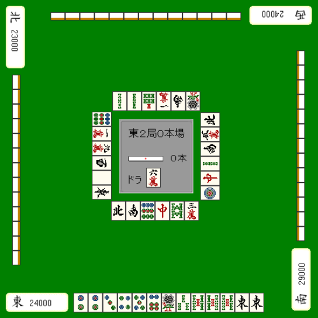

# 牌效率 20—向听倒退

向听倒退：  先要说结论的话， 向听倒退最终能让牌形成快速和牌的形的情况是不多的。  这种时候一般是看到断幺、混一色等手役选择倒退， 由于能够鸣牌，在结果上变得更快了而已。 另外就是由于所听牌几乎没有了（被碰掉或者是边张听牌等）才会选择向听倒退。 “向听倒退就是为了提升打点的技术”，这样理解比较好。

 1.不选择听牌

靠张一向听进张数很广，但是形成愚形的牌也多，这个在上次已经说过了。 像例 1 这样的牌，断幺和平和都没有的摸牌还是不去听牌的好。 切掉 1 索，这个牌怎么也想把断幺先保住然后再立直吧。

 能够碰双东的话就听牌了， 但是所听牌 2 索场上已经切了 3 张。  因此不去听牌切 1 索是好手。 我们自已也明白，之后形成 1、4、7 饼或者 3、4 索会更加容易和牌。

 2.两向听倒退

  这也是一个想要做断幺+平和而向听倒退的例子。

 边 3 饼是这个手牌的瓶颈， 切掉 1 饼选择向听倒退是好手。 虽然这里可以打 8 万，保留摸到 3 饼立直的一手， 但索子有两个两面，保留万子双碰进张会比较好一点。 虽然错过了摸到 3 饼立直的机会，但是这个牌马上就可以断幺+平和立直了。

 例 4 的进张数可以说是少的过分。 能够进入听牌的进张只有 3 万，就算听牌了也还是边 3 万的超恶形。 虽然这个例子比较极端，这里毫无疑问切 1 万返回两向听。

 虽然是一向听， 但是这样的好形很想去做断平三色啊， 这个是毫无疑问应该拆掉 7、9 饼搭子的牌。

 3.序盘向听倒退

  最常见的就是做混一色的例子了。

 由于搭子不够，这里切掉 3、5 万比较好。（返回三向听）  向听牌的最短距离前进自然是基本， 但是从和牌的容易度以及打点方面来考虑，

一味的“降低向听数”也不一定是正确的。 兼顾速度与高度的打法是非常重要的。  以上就是牌理的讲座，下次开始我们就来说说手役吧。    （待续）