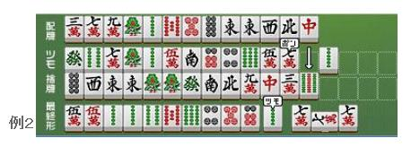
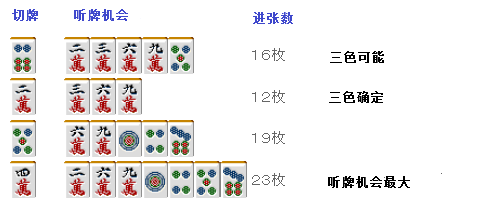

# 手役 2—手役的考虑方法（二）

手役的考虑方法（二）：

 1.手役是形成的

 一般来说，手役并不是“有意识”去“作”的，而是形成的。 脑海中把最终形先定下来，然后把不要牌全都切掉的打法叫做“定打”（注：先这么翻译吧，有正统翻译请留言），这种“定打”还是千万不要做为好。 麻将中是不能决定自己所摸的牌的。 所摸的牌和你自己选择的打牌是完全没有关系的， 因此，配合自己的摸牌来作手役是一个准则。 “定打”是绝对禁止的。 （注：这是我觉得是打麻将的一个重要思想，以我的理解主要是说：千万不要“我想去作 XX役而去期待后面的摸牌”，而是要“如果我摸到某某牌，这张牌能够作什么役”）

 假设自己最后一位，拿到了这种 8 种九牌的垃圾牌。  在这里切掉宝牌 4 饼决定作国士无双就是输家。 宝牌重叠的话还有七对子的可能性，在第一巡就切掉了还搞什么？  就算有国士无双的可能，无赤牌的话应该切掉 5 万或者 6 索保留全带或者七对子的可能性， 有赤牌的话，就切掉 1 饼吧。是亲家的话毫无疑问应该切掉 1 饼。  即使是这种配牌，要是役牌重叠的话也还是可以和牌的。 这全要看摸牌了。  “定打”可以说是一无是处， 还是赶快放弃这种错失各种可能性的打法吧。 根据摸牌才是最好的打法。

 2.手役的优点是

 虽说手役的价值是为了提升打点， 但是现在的麻将宝牌、赤牌和祝仪在收入方面也是很强的。  另外，手役也可以看作是为了鸣牌而存在的。

 一眼看去这是一个宝牌 3 的走运牌谱。 但是却充分采用了作手役的打法。  从牌谱可以看出，在拆掉东和 1 索的对子之前一直都把役牌（这里自风是北）留着。 有两张赤牌的手牌，无论如何都是想要和牌的吧。 但是要门清立直又太过遥远。  所以这里选择断幺或者役牌， 即使鸣了牌也能够和牌。  “能够鸣牌”对于有赤牌的麻将是非常重要的。 “有手役”=“能够鸣牌”=“速度快”，这个公式就成立了。  手役用来提高速度是现代麻将的一种思想。 正是因为能够随便鸣牌，所以断幺在有赤牌的麻将中是非常受重视的。

 3.手役的缺点

  手役的缺点根据手役不同各有差异。 自然“使进张数减少”是最大的缺点。

 比如例 3 这个牌，切掉 2 万可以自然地去作 234 的三色。

 但是例 4 的话，作三色进张数就会减少。

 虽然三色和牌之后点数更多， 但是我觉得这个牌还是选择切掉听牌机会对多的 4 万为好。  当手役（打点）和速度不易割舍的时候， 大部分时候以速度优先会取得更好的结果。  手役的另一个缺点就是：能够使用的牌被限定了。  比如宝牌是饼子的时候，作索子的混一色就用不上宝牌了。 作全带时摸到赤牌也让人头疼。 还有，你们没有自己七对子听牌之后立直，然后又摸到了自己已是对子的第三张张牌这种让人郁闷的经历吗？  手役有时候会拉速度和防守的后腿，记住这个就好。   （待续）