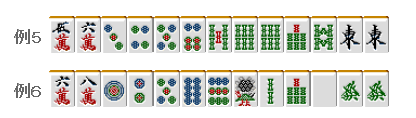

# 手役 3—役牌

役牌：  役牌（翻牌）的好处就是没有限制。 断幺和平和虽然也是容易和的役，但是 14 张手牌都有限制。

 没有其他只需要 3 张牌就可以搞定一翻缚的役了。 而且鸣牌也是 OK 的。  实际上麻将中出现率最高的手役就是翻牌役了。 能好好处理字牌的话，结合鸣牌可以提高不少和牌率。

 1.留下翻牌

  配牌之后，一般情况下是按照  “客风牌→役牌→不要的数牌”  的顺序开始切牌的。 但是由于翻牌可以成役，所以尽量还是按照  “不要的数牌→役牌”  的顺序切吧。  数牌的有效牌更多这个是事实， 但也不得不选出不要的数牌。

 比如这个手牌，不切发和白，切 9 索也是可以的。

 例 2 的情况，两面搭子已经够了。 拿着 6 索几乎没有什么价值。  比起构成新的面子，能够让发重叠的话应该更高兴吧。  2、5 万和 5、8 饼的进张没什么问题的话，这里就切掉 6 索。

 2.翻牌还是断幺？

一般情况下还是断幺更有利。  准备鸣牌的话，还是断幺更加容易一些。而且也更容易与平和等其他役复合。

 例 3 的情况，切掉發选择断幺更加好一些。

 但是例 4 这样的断幺并未确定的牌的话， 不切發，切掉 8 饼或者 5 索比较好。  总结、理论： 打点相同的时候，确定的手役比不确定的手役更有利。

 3.关于鸣牌

  一般情况下，第一次鸣牌也没关系。 经常听说役牌要在第二次鸣牌，不过我觉得这是比较古老的战术了。  首先，和了小牌的话能够破坏其他人的机会 这是比点数更加有价值的。  第二是，如果是有赤牌的话。鸣牌引入赤牌也是有获得高得点可能性的。  然而最重要的就是，现在的许多打法都很重视速度， 第二次鸣牌有时候会来不及的。  事实上，上级者也是第一次鸣牌的时候居多。 不要被“第一次鸣牌是难看的手役”这种古老的价值观所束缚了。 现在麻将中第一次鸣牌是基本。  但是像例 5 这种完全可以门清的牌和例 6 这种手牌参差不齐的情况，还是不第一次鸣牌为

好。

 总结、理论： 需要第二次鸣牌的情况要嘛是手牌太好，要嘛就是手牌太差。   （待续）