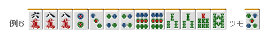
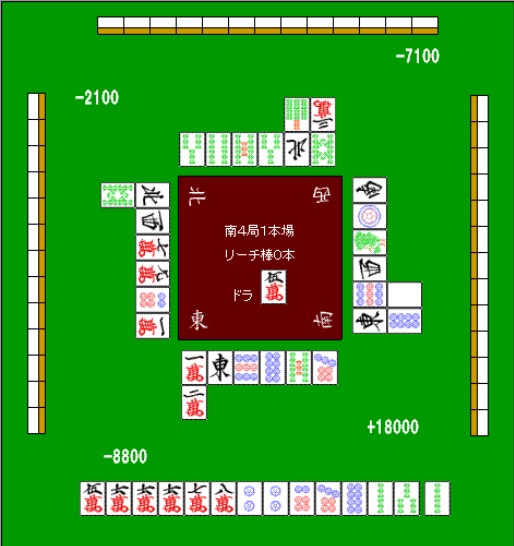

# 手役 4—平和

平和：

平和是最容易作成的役之一
只要效率把握的好，手牌自然能够形成平和。

1.两面的变化

平和全部都是有顺子构成的，而且最后的听牌形必须是两面。
所以作两面就是作平和的要点。

例 1 可以作为第一章的复习。

根据“嵌张比边张有利”的理论，所以这里应该拆掉 1、2 万的搭子。
饼子摸到 5 饼就可以形成两面，平和确定。

就算摸到 6 饼形成两嵌进张也比较广，
边张是没有这种变化的。

例 2 是嵌张之间的比较，这里比较一下两面变化吧。
万子摸到 2 万或者 6 万都可以形成两面
而饼子只能摸到 4 饼才能形成两面 因此这里应该拆掉饼子的嵌张。

但是，摸到 4 饼的话就要拆掉 3、5 万了
因此这里一定要从 1 饼开始拆。

 2.两嵌

这里也先复习一下第一章。

两嵌是嵌张相连，类似 4、6、8 万这样的形。
摸到 5 万和 7 万都可以形成顺子，是仅次于两面的好形。

利用两嵌也可以更加容易的形成平和。

比如这个手牌，让饼子形成两嵌切掉 4 饼是正确的打法。
虽然切 8 饼进张数没有变化，
但是切 4 饼形成平和的可能性更高，对打点方面更有利。

3.拆对子

雀头是翻牌的时候不是平和，这个需要注意。

比如这个手牌，选择切掉中是很通常的打法。
是兼顾断幺和平和的打法。

不要选择碰中去和这种 1000 点的牌， 应该以门断平这种高分手牌为目标。

像这样拆掉对子作平和的情况是很常见的，这个要记住。

例 5 是一个有名的问题

切 7 万和 2 饼是不一样的。

切掉 7 万的话，万子就是，有 6 万的进张。

这种两面+嵌张的牌，千万不要看漏了。

例 6 切 6 万的人只能说没什么悟性了啊= =，这里应该拆掉 9 饼的对子。 摸到 7 万就可以进入平和一向听，摸到 2 索或者 4 索仍然可以作平和。

虽说也可以拆掉 3 索的对子，
但是这样的话，只能摸到 5 万才能形成两面，

剩下了一张 3 索的浮牌，
不仅 3 索是一张比较危险的切牌，切掉之后也会没有安全牌。

这里还是推荐拆掉 9 饼的对子。

手役 5—断幺
断幺：  断幺最大的好处就是鸣牌之后也能和牌，这个我们应该尽量利用。 特别是最近加入赤牌的麻将，食断的威力可是非常巨大的。  “断幺 DORA3，8000 点”，铳了这种牌一定让人火大。 但是对食断这种牌弃和又太说不过去。 在雀庄打牌有赤牌和祝仪，食断渐渐在成为最强的手役。

 1.向着断幺打牌

  断幺不仅容易作成，也是可以与其他役复合的方便的役。 因此，考虑断幺的可能性去打牌是很重要的。

 例 1 应该切掉 1 万。 摸到 6 饼，可能有断幺平和，摸到 3 饼或者 4 饼还有断幺三色的可能。

 例 2 就拿 6 饼替换掉 9 饼吧。摸到 2 万或者 4 万可以形成断幺。

 2.确定断幺

 上图的状态我们叫做“面子超载”，到底切什么是正确的呢？ 这里拆掉 2、3 索的搭子是常识。摸到 1 索的话也就只有立直这一个役。

 只是要进张广的话，这里应该切掉 6 万。不过一般的打法这里会切 9 万。 不断可以确定断幺，还可以准备鸣牌。 这牌也还有 567 或者 456 的三色的可能性。

 3.考虑鸣牌

 这个手牌摸切 2 索是进张最广的，但是实战中我会切掉 6 万。  如今是 AL 自亲，无论怎样都是想要和牌的状况。切 6 万也是考虑到食断的一手。 切掉 2 索，碰 6 万或者 2 饼之后也只能单面听。

如上图这个结果的话，就有 5200 点哦。    （待续）