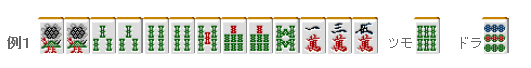
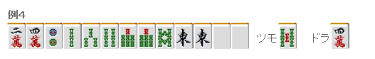

# 手役 6—染手（一）

染手（一）：   染手系，特别是混一色是非常重要的役。 不仅容易作，而且门清 3 翻，鸣牌之后也有 2 翻。 能够有这么优秀的点数面的役还真没有了。 虽然容易被对手警戒，但还是需要积极地去作。 牌的材料好的话，可以从配牌之后就开始作。  本回讲从手牌来看是否要去作， 手牌以外的要素还有：  ·场况 ·巡目 ·所持点  这一回就暂时假设是点数并没有太大变化的东场序盘（即平场） 仅仅从手牌来判断。

索子有 11 张，而且形还不错。 端牌是 1 索的对子，3~8 索是相连的。 这牌仿佛就是再说“作清一色吧~” 这牌只要还没到终盘，应该向清一色前进。  考虑到将来的危险度，这里先从 5 万开始切。 考虑到摸到 6 万形成两面而从 1 万开始切是很通常的打法， 但是这个牌万子的两面还是不要了吧。

 “当有 10 张以上的同色牌就可以随时染手”，这么说是不对的。 例 2 就有 10 张饼子， 但这里应该果断切掉發。  这个牌是一副立直平和牌， 根据摸牌还可以有可能形成断幺、三色或者一气贯通。 这牌不去染手已经很不错了，所以没有去染手的必要。  为了染手去染手， 这样打牌是非常危险的。 破坏已经形成的面子而去强行染手迟早是会死的很惨的。  总结、理论： 不用染手的牌不要强行去染手， 为染手去拆已经形成的面子是禁止的。

 但是，麻将中也是常常有例外的。 像例 3 这种牌，染手能够让打点大幅上升。 容易和牌的话就果断把饼子拆掉了吧 但这是非常少数的例外， 在平场几乎没有应该拆掉一面子而去染手的牌。

 有两个役牌的对子，应该向这某一种花色前进作满贯。 虽然例 4 有一个含有宝牌的搭子，但仍旧应该向着索子的混一色前进。  但是有一点需要注意。 初学者很多都会选择把宝牌 4 万先切掉。 这就搞的太过火了。  混一色的缺点就是容易暴露 从宝牌开始拆嵌张的话 其他人就几乎能看出你是索子混一色从而有所警觉了。  好不容易有手好牌， 一般从不起眼的 2 饼开始切，这样会稍微容易和牌一些。 虽说染手是主线，但是还是要保留摸到 3 万的可能性啊。  理论、总结： 有两个役牌对子的话， 尽可能的染手作满贯。

 现在南是客风， 坦白的说这是一手垃圾牌，不过我会选择作索子的混一色。 首先从 5 饼开始切吧 反正这手靠他也和不了  当混一色相当遥远有可能中途弃和的时候， 从真中间的牌开始切让对手提高警惕从而巩固自己的防守也是一种打法。  由于鸣牌比较醒目 考虑到防守能力的话还是不要去鸣牌了。  只要白和北没有重叠，这里最好采取不急于和牌的方针。 初学者有时会在第一张南出现的时候就碰， 这里必须要注意到这个牌和牌的机会是很小的。

 “这个牌不和也没关系”，拥有这份淡定也是非常重要的。  理论、总结： 很痛苦的混一色要重视防守 没有见到和牌希望之前不要轻易鸣牌。   （待续）