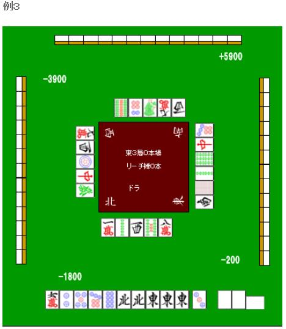

# 手役 7—染手（二）
染手（二）：  染手最重要的技术其实是“鸣牌”， 这个我留到第五章再说。 这个章节我们来说说混一色的手筋。

 1.过渡打牌

 例 1 在已经碰了中的情况下选择切牌，理论上还是切 6 万。  留下索子的连续形，之后还可以向混一色过渡。

 如果巡目尚早，能够碰 9 索或者西的话 就可以不听牌而去作混一色。

 例 2 就应该选择听牌了。 即使张数要少一张，这里也应该单骑听牌。 再摸到任意一张饼子或者字牌就可以形成混一色，这是理所当然的选择。

 能摸到 8 饼形成多面张是很理想的。

  2.先打

 迷彩战术是比较老的战术了。 少数时候能对混一色有一定的效果。

 必要的面子已经凑齐了，这里不要随便地把 6 万切掉，而是应该切掉 5 饼。 虽然混一色就差一点点了，但是这个时候很容易被对手看破。 上图是摸到 3 饼切掉 5 饼，如果是摸到 4 饼的话，切掉 2 饼就好了。

 3.让形变强

 同种花色的牌集在一起时，形就会变得很复杂。 门清的时候常常搞不清楚自己听什么牌，挺烦人的。 现在都还能看到把手牌 3 张 3 张分开看的人。 这个是需要习惯的。

 这个形是不是让你很迷茫呢？ 正确答案是切掉 3S，听 147 索。 实战中常常有人因为马虎，没有考虑自己已经碰过的牌。这一点需要注意。 这里听 369 索的话就只有 5 张和了牌了。

 不规则听牌也是一样，记住有代表形的东西为好。 现在的情况是一个三面听。 切掉 3 万，听 569 万是比较有利的。 “一气贯通”是很容易被忽视的手役，千万别把这个忘了。   （待续）