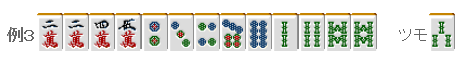

# 手役 8—三色

三色：  由过去的手役花色变来的三色， 在现代麻将中渐渐成为了配角儿。  但是其容易作成，而且有 2 翻，在实战中也是经常作的。  有关三色的手牌很多，但是实战中出现也是有限的。  三色同顺重要的不是要去作，而是不要看漏了三色。 我们从基本的手法开始看吧。

 1.滑动

 为了形成三色，保留万子、饼子、和索子的面子是三色的基本。

 看一个简单的例子，例 1 是一个平和一向听。 这里摸到 6 饼的话，换掉 3 饼就可以形成一个三色一向听。

 同样的，这里摸到 2 饼的话可以换掉 5 饼。

 向下滑动，形成了 234 的三色 虽然很简单，但这是最重要的三色手法。

 2.两天枰

  这是作三色一个有名的手法。

 这个牌重视进张数的话，应该切掉饼子。 但这里切 7 索才是基本的一手。

 这样就可以同时作 678 或者 789 的三色了。 这样的打法叫做“三色天枰”或者“两天枰打法”。 但是，实战中出现的机率基本上没有。

 3.剩余牌的利用

 这里是选择切掉其中一个对子。 这里切掉 2 万才是正确的。

 要是走运的摸到 3 万，2 万就被激活了  灵活运用剩余牌而去作手役的情况是非常多的

 这里一眼看上去没用的 2 索，其实是 123 三色的一个引子， 这里切掉 1 饼才是最好的吧   （待续）