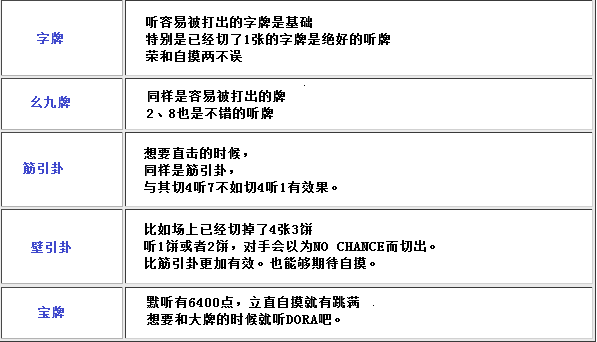

# 手役 9—对子手（一）

对子手（一）：   首先来看看七对子和对对，到底做哪一个好呢？

 1、6 组对子

  七对子已经听牌的话，转手去做对对是恶手。 有能够碰的牌不要去碰，应该等到比较好的单骑牌之后立直。

 这样的手牌如果是序盘听牌那是另外一回事儿了， 只要不是特别极端的牌， 好不容易七对子听牌了，碰牌返回两向听是很不值得的。  总结、理论： 七对子已经听牌的话，不要乱去碰。

 2.5 组对子

  5 组对子正好是两方的一个分歧点。 向听数的话，七对子是一向听，对对是两向听。 但是，七对子必须要在剩下的三张牌中重合一张， 从一向听到听牌是比较费时间的。  这个时候根据手牌情况，向听倒退，选择对对有很多好处。

 例 2 这样的牌，选择对对是比较好的。 容易碰的牌很多、有役牌对子是其中的原因。 容易碰的牌就是指容易被打出的牌， 比如幺九牌（数牌 1、9 和字牌），接下来就是数牌的 2、8.是比较容易打出的。 数牌 3~7 是很容易被利用的牌，相对而言一般不容易鸣牌。 这就是断幺+对对比较难做成的理由。  总结、理论： 幺九牌比较容易鸣牌，数牌 3~7 不容易鸣牌。

 例 3 的手牌就不应该鸣牌了。 鸣牌的话最多也就 2600 点，而且不容易鸣牌的牌比较多。

 打点低，又不容易和，而且防守力也差。可以说是一个典型的臭鸣牌。  总结、理论： 有容易鸣牌的对子 有 3900 点以上的收入 巡目尚早

满足以上条件，从七对子一向听转对对才是正确的。

 例 4 又怎么办呢？ 虽然有比较难鸣牌的对子，不过这里还是应该鸣牌。 这个手牌即便不是对对，也还有断幺或者役牌發这一手。 总之先碰，然后切掉白。 根据情况再选择是对对的 5200 点，还是 1000 点

 一下子把 4、5 索切掉有点太过乱来了。这是一厢情愿的打法啊。

 3.4 组对子+1 组暗刻

  选择四暗刻的两向听是符合理论的打法。

 像例 5 这样的牌，切掉 3 饼、4 索、白中的任意一张是基础。 进入七对子的 6 张进张的一向听，有能够碰的牌之后再向对对前进。  从向听数的比较来看，对对的听牌难易度比七对子有着压倒性的优势。 而且还有三暗刻、四暗刻的可能性，应该保留对对。  总结、理论： 做成一个暗刻的话， 那就是七对子和对对的天枰， 碰牌出来的话就碰！  但是，要是有场上已经切了两张牌的对子（已经不可能形成刻子的对子）的话， 就应该切掉 5 万、选择七对子了。 去做那概率让人绝望的役满也是不可取的。

手役 10—对子手（二）

对子手（二）：  上回我们讲了七对子的作法以及其理论。

 1.七对子和面子手的分歧点

  一般情况下，七对子和面子手的向听数一样的时候， 面子手进张数更多，听牌更加容易。 当面子手的向听数比七对子更低的时候， （比如七对子是两向听，面子手是一向听） 就向着面子手前进就好。

 例 1 完全没有七对子的样子，打 8 万。

 但是像例 2 这样的手牌，七对子的两向听。 面子手还是两向听的情况该怎么打呢？  面子手的打法：切 2 饼 七对子的打法：切 3 万（切掉宝牌提示牌）  以前是主张两者之间选出一个比较好。 但是保持面子手和七对子双方的可能性是现在的主流打法。  这里切 7 万是能够兼顾两方的一手。 断幺+宝牌 2 是手牌的本线，保留摸到 2、3、5 万的七对子进张，所以不能切。 虽然这个决定有人会批评说优柔寡断，但我还是觉得切 7 万是正确的打法。

 例 3 只考虑面子手的话，就切 9 索吧。 要两者兼顾还是切 1 饼比较好。  总结、理论： 面子手不好的时候要留下七对子的可能性

 例 4 怎么办呢？ 要兼顾两方的话切 4 饼。 虽说切 4 饼不太坏，由于例 4 的形很好， 就算留下七对子的可能性，最后也还是面子手成形的机会更高。 选定面子手，确定宝牌的面子，切 3 万才是最好的一手。

 2.七对子的听牌

 能够立直的话，就应该尽早立直。 但是例 5 立直的话就有些疑问了。  不管听什么牌都不容易和。 比如自己有赤 5 饼，然后立直单骑 5 饼明显就是愚策。  单骑听牌的张数也就只有 3 张， 既然只有 3 张，那么就不应该选择那些没有什么和出期望的牌。  说到应该听什么牌的话……

 单骑听牌是能够有意图针对的。 场上已经切掉 1 张的客风牌是最好的听牌。

 如果 7 饼是生牌的话（场上一张都没有切），场上切了 1 张西的时候， 就应该单骑西立直。 虽然听牌是 3 张和 2 张的区别，但是和牌的容易程度确实一个天上，一个地下。  总结、理论： 单骑听牌要根据其和牌程度有意图地进行选择。

第四章：宝牌和赤牌

宝牌和赤牌 1—宝牌的对策（一）

宝牌的对策（一）：  只要拿到宝牌就可以提高手牌的翻数，这是很给力的。 不浪费贵重的宝牌的打法是非常重要的。

 比如这样的手牌，为了一杯口而去切掉 2 饼的话，

 宝牌就用不上了。  如果先前打 5 饼的话，还可以用 4 饼和宝牌的 1 饼替换。 为了不犯这种低级的失误，要常常考虑一下摸到宝牌的情况。

 这里切掉 4 索的话，宝牌 5 索的进张就没有了。 这个牌有 345 的三色的话，不必须要切掉 2 索了。

 有一个不需要的雀头时看似随便切哪个都好，

考虑到宝牌进张的话，还是切掉 4 饼最好。

 摸到宝牌的话可以切掉 4 万换掉雀头。  “就算切掉了 4 万，留下 1234 万四连形不就好了？”说不定有人会这么想。  但是留下宝牌的筋牌是很危险的，当摸到 7、8 万，7、8 饼的时候。到底是应该放弃还是保留宝牌进张会让你非常困扰。 因此切掉 4 万是不正确的。

 含有安全牌的一向听。 我觉得留下 2 饼，切掉安全牌是正确的打法。 像这样的牌型，我觉得把形固定下来打是不对的。  摸到宝牌 3 饼不仅让手牌打点提高，进张数也从 12 张倍增到 24 张。  虽然知道了这里不能切掉 2 饼， 不过这个牌还是没有打点，很难反击的。 要是有人先制立直了，还是乖乖弃和吧。  总结、理论： 要考虑宝牌进张去打牌。 打点和进张都不好的时候，不要放弃宝牌的进张。     （待续）