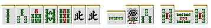
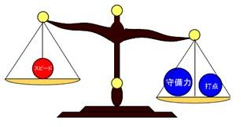

# 宝牌与赤牌 3—宝牌 2 以上的情况

宝牌2以上的情况：

自己的宝牌有2张以上时可是好机会。 向着和牌的最短距离前进吧。

别太贪心

 例1切掉3饼就是中、白、对对宝牌2跳满确定。
但是这样的话就太过了。切掉4饼虽是满贯但是所听牌增加一倍已经够充足了。
把满贯的两面做成跳满的双碰或者嵌张等可就亏大了。

 这是一个门混宝牌3的跳满牌，要是这里摸到7索的话

比起切掉就9索做倍满（门混一气宝牌3），切掉1索听2589索才是正解。
正因为是大牌，所以才应该追求和牌的容易度。

另外，如果例2的牌，9索出来的时候应该碰，然后切1索。

虽然好不容易做成的门混变成了了满贯，但是这样可以听367索。
有宝牌的暗刻，听的牌多就算让手牌价值下降一点也没关系。

 如果發不是宝牌的话，这里切掉4万做234的三色同顺也不坏
如果有宝牌暗刻的话，就直接切掉2索直指听牌。

能从上家鸣牌的话就吃听，
鸣牌也能够满贯，没有错过的理由啊。

鸣牌前提的准备

 由于宝牌2、宝牌3即使鸣牌也能够获得高得点。怀着“自然要鸣牌”的想法大牌是很重要的。

南场发到这样的牌。
这里能切的牌出了9饼没有其他的了。
固定两个宝牌，这里断幺宝牌2、或者役牌重叠就有3900点。
作为“特快劵”的役牌有着比较大的价值。

宝牌2的话就果断切掉1饼，向着食断前进就好。
与切掉7万或者6饼去做门清、七对子想必，食断无疑要快得多。
理论、总结：
有两张以上宝牌的时候要重视速度与和牌的容易度
应该把鸣牌作为做牌的前提。

宝牌与赤牌 4—切宝牌的时机

宝牌2以上的情况：

切宝牌的时机总是让我很头大。
早了不行，晚了也不行。

役牌和宝牌的情况

被鸣牌之后最糟糕的是什么牌——役牌的宝牌。
要是问我最佳的切牌时间是什么时候，
回答就是第一打或者听牌的时候。

为什么会说第一打，那是因为
切牌后最不容易被碰或者荣和的时候就是第一打
比如在终局且是 TOP 的时候配上这样的牌。

第一打就应该切掉白。
目前是只要能和牌就好的局面，而且还有平和的机会，这里没有抱着宝牌不放的必要。
但是只要能和牌就好的局面是十分有限的。
即便是单纯地重合拿来做雀头也能够使打点大幅上升
所以多数情况还是为了打点而把宝牌留下。

 这样的一向听把宝牌切掉的话就太吃亏了。
宝牌要是重合的话可以做雀头达到满贯。

“宝牌拿的越久就越危险”是不能成为什么理由的。
这完全是错误的想法。
要是宝牌被碰了的话，那所有的牌就都危险了。

这个牌听牌的时候才是切宝牌的时候，宝牌是立直的宣言牌才是正确的。

理论、总结：
不要牌要比宝牌先切出去

要是在上面的一向听情况下摸到了9饼

手牌是3456万、6789索进张的一向听的时候才有切掉宝牌的价值。
而且这里要是摸到45万、78索的话可以考虑加入双碰进张。

宝牌容易切出的时候和无论如何都要和牌的时候，这种牌可以切掉宝牌。
具体的说就是：
亲子关系
序盘没人鸣牌
场上已经切出了宝牌

这样的情况下
符合条件可以切掉宝牌
但是，有不要牌的情况下还把宝牌切掉这种半吊子的打法可以不可取的啊。

其他的情况

我自己的打法是不太重视宝牌的
我觉得没有必要为了宝牌而使自己的进张变窄。

 这样的牌我会毫不犹豫把宝牌切掉。
虽然进张宽度不同，但是有平和、一气一杯口等手役
我觉得没有留下宝牌的必要。

 虽然无法使用到2张宝牌，
这里切掉宝牌是进张最广的。

摸到4饼、6饼、5索可以进入平和的一向听，
看看四人的点数也没有做大牌的必要，这里就应该把宝牌切掉了。

一向听的话，这个局面比起宝牌还是以进张的宽度优先。
但是，不仅仅是这种局面，切掉宝牌有较高的放铳可能性的。

宝牌与赤牌 5—宝牌和手役的选择

宝牌和手役的选择：

很多时候，宝牌和手役放弃那一边都不行。 我们来看看这种时候该怎么打吧。

 听牌时的选择

  基本的就是选择听牌最多的

 这个牌切掉2索立直才是正确的。 由于宝牌表示牌已经使用了一张3索，所以这里嵌3索只有3张了。 还不足69饼+4索的一半多。 即便是做成了三色同顺，得点也没有成倍的增加。这里三面听牌是压倒性的优势。

 这次是切掉宝牌选择平和更加有利。  虽然是3900点的8张听牌和5200~8000点的比较， 平和立直要是再有一发或者里宝牌的话就能成满贯， 和其他对手的听牌竞争中听的牌越多也就越有利。

 像例3这种得点有一倍差距的情况， 还是手役更加有利一点。  不想让这局结束得太轻松的话，这里就切掉3饼做对对吧。

 一向听的时候

 这里面子超载，自然选择切掉搭子。 做成234的三色同顺有高目，没有做成高目的话就只有立直 NOMI 拆掉宝牌的搭子是非常大的损失。  拆掉8饼、9饼会使速度降低，也是不行的。  总结、理论： 确定的一翻一般情况下比不确定的两翻有利。

 宝牌2而且有456三色同顺的好机会啊。  但是这个牌打实际一点我觉得还是切6饼最好。 手上有进张广的四连型，还能够有抵抗的能力。 而且这里也没有切掉宝牌去做三色同顺的必要。

 这里就切掉宝牌吧。 做断平三色这里是用不着宝牌的。 宝牌和手役哪一个更优秀是不能够下定论的。 有优先手役的情况也就有优先宝牌的情况。 选择哪一个要根据进张是否广以及是否容易和牌来决定。  总结、理论： 宝牌和手役的选择，按照进张是否广来进行判断是很少失败的。

 序盘的选择

序盘的话，留下宝牌和手役两方的可能性很多时候能形成好型。

★东一居 第二巡 南家的手牌  有万子混一色的机会，宝牌是浮牌 这里切掉宝牌或者东中，都是不太靠谱的打法啊。 字牌重叠的话能够凑成混一色必要的搭子。 这个牌要是切掉东中之后再摸回来就太痛了。 切掉宝牌5索也太早了。宝牌重合的话可以有与混一色相当的点数。 摸到4索、6索的话就放弃混一色吧。 结论就是，拆掉5饼、7饼的搭子是序盘比较妥当的选择。  虽说“鱼和熊掌不可兼得”，但是这句话在麻将中也是不一定对的。 特别是在序盘，应该采取留下各种可能性的打法。

宝牌与赤牌 6—赤牌麻将的基本

赤牌麻将的基本：
 最近街头巷尾的雀庄几乎都使用了赤牌。 特别是免费雀庄有祝仪，有些还有赤牌 NOMI 和牌的雀庄。 赤牌麻雀处于全盛时期的现在，迎合赤牌麻雀的打法也是必要的。

 比起手役，应该更加重视进张的宽度

  由于宝牌的增多，所以不做手役也可以和出大牌。 不要太拘泥与手役，重视进张宽度和速度。这点要记在心里。

 比如这个牌，看起来应该做三色， 不过这里切掉饼子的嵌张会更快。

虽然拆掉了好不容易形成的三色同顺，不过这就是赤牌麻将的打法。

 不要拘泥与门前清

  宝牌多的话，即使鸣牌也能有可观的收入。 鸣牌可以说是赤牌麻将中非常重要的技术。

即使是食断也有3900点， 7万的碰，3饼、6饼、258索的吃，什么进张都可以。 即使是不改变向听数的鸣牌，在赤牌麻雀中也是经常用到的。

 全带是不利的

  尽量不要去做用不上赤牌的全带、纯全带、混老头等役。 鸣赤牌然后被和牌的话会让人不爽，而且即使没有鸣牌， 到了终盘也最好不要切4~6的牌。

有的话都会去听嵌4饼的吧。
有赤牌的话，大家都会选择赤牌的靠张， 所以3、6；4、7的筋牌是比较危险的。 而且5本身作为听牌的情况也增加了，甚至还会有赤牌单骑的情况。  因此，做全带系的牌可不是一个好的策略。

 好不容易做成这个样子也就继续往下做了吧。 鸣牌一两千点也就草草地和了吧。  很多的战术书都说“不要去鸣牌做低廉的全带”，但是这已经是很古老的想法了。

比起老老实实地打门清，不如灵活运用“鸣牌更容易和牌”的这个优势。  要是老老实实地打，结果估计就是被自摸“门平两赤牌”，这就太浪费表情了= =

 考虑赤牌的进张

 和宝牌一样，尽量保持摸到赤牌也不会犯难的牌型。

 一向听的这个牌是切掉1饼还是4饼呢？普通情况下切掉4饼是正确的。 因为要是等一下有人立直的话，再次摸到4饼的时候，这里就可以切掉多少安全一些的1饼。 但是赤牌麻将的话，就一定要切掉1饼。 要是摸到赤5饼的时候，可以换掉2饼。

第五章：鸣牌
鸣牌 1—鸣牌的优点与缺点

鸣牌的优点和缺点：
牌打的好与不好，其中的差别就在“鸣牌”上。 该鸣的牌不鸣，该门清的时候又鸣牌的情况是随处可见。 我们重新学习一下鸣牌的技巧吧。那么首先要认识一下鸣牌的优点与缺点。  优点 1：加速听牌 通过鸣牌能够加速听牌，让和牌更加迅速 和牌更加迅速了，因此能够破坏其他对手的机会，效果是很不错的。  优点 2：能够做成门清难以做成的役 门清很难做成混一色、全带等役，但是鸣牌的话也不是那么痛苦了。 而且染手基本的就是鸣牌进攻。麻将可不像漫画里那样轻而易举就可以做成门前清混一色的。  优点 3：消除边张、嵌张等急需进张的地方

 比如这个手牌，假定 3 万已经出现了两张。 然后上家切出了 3 万。这个时候就该毫不犹豫地吃。 这种牌要是强求门清，和出的机会是很小的。 要是没有注意到 3 万场上已经切了两张的话， 就会错过 3 万从而让和牌的机会跑掉了。  优点 4：能够做成新的面子改变所听的牌

 虽然满贯听牌，但是听牌是糟糕的 3 索和北的双碰。 这个时候要是上家打出 2 索的话就果断吃。

 我觉得这种把听牌改良的技术绝对是是非常有必要学会的。

其他的优点： 鸣牌还有破掉其他人的一发，隔掉他家的摸牌等等作用。   缺点 1：降低打点  三色和混一色鸣牌后会贬值，一杯口和平和鸣牌之后会不计。 另外，自然也就不能立直。鸣牌也就放弃了一发和里宝牌。不能否定，鸣牌会导致得点大幅降低。 这是鸣牌最大的缺点。

 这虽然是一个极端的例子，这样的牌应该没人会去鸣牌吧（笑） （AL 和牌即 TOP 的情况除外）  麻将仅仅反复和小牌是无法取胜的。应该组牌门清立直。 哪怕仅仅是立直 NOMI 的牌，只要是立直的话也常常有成为满贯的机会（立直一发自摸宝牌1）。 要忍住鸣牌的想法，多多重视门清。  缺点 2：手牌容易被看破  这个初学者暂时不用考虑这个……恩= =  缺点 3：防御力减弱  三副露的手牌只有 4 张，要是这个时候对手立直了怎么办？ 这就让人头大了，门清还可以兜牌。 通常这个时候自摸切的人一定是觉得怎么样都无所谓了吧（笑）。  由于麻将中自己没有和牌的局数比自己和牌的局数要多，因此兜牌的情况很常见。 然而对手立直的时候多考虑一下再打牌自然是很重要的。  缺点 4：固定了手牌，限定了手役的可能性

 要是这个手牌，中打了出来会碰吗？我是不会碰的。 这个牌鸣牌的话也就只有 1000 点， 应该把手上的两个中都切掉做门断平。 还有一杯口和三色通顺的可能性，说不定还能有宝牌。

就算第二张中出来了我也还是不会碰的。  上面是写得很详细的，简单的说就是……  鸣牌的优点——速度上升~~↑ 鸣牌的缺点——打点下降↓、防御力下降↓  这样理解会比较简单一些。  鸣牌与不鸣牌就要根据鸣牌的优点和缺点来进行考虑。
鸣牌 2—副露判断的基本

副露判断的基本：
 秉承前回，我们来看看鸣牌与不鸣牌应该如何判断。

 以东一局得子家为例子，第三巡打出了中。 要鸣牌吗？  我们来看看其优点和缺点吧。  优点： 确保了一翻，和牌更加容易。  缺点： 防御力下降 得点只有 1000~2000 点  鸣不鸣牌 应该以鸣牌时优点与缺点那边更大作为判断的标准。  我们想象一下下图的天枰

向左边倾斜就鸣牌，向右倾斜就不鸣牌。 这里关键的是，每个要素的重量是会根据场面的不同而发生变化的。  我们来具体分析一下。

 速度：虽然确保了一翻，但是剩下的型不太好，就算可以鸣牌和牌的机会还是很小。→速度上升的优势比较小  防御力：为了和牌还要继续鸣牌的可能性很高，听牌的巡目深了是很危险的。而且现在也还没有一张宝牌。→防御力下降的缺点是很大的。  打点：只有 1000 点的可能性很高，即使是门清打点也不高。→点数下降的缺点虽然小，但是这个牌打点本来就低。  接着也必须考虑一下自己是子家的因素，大致就能够有这样的天枰。

天枰向右倾斜了，所以这个牌还是不鸣牌的好。

南一局得亲家，+2000 点处于第二位。第六巡的手牌。  上家打出了 6 索，我们用同样的方法来进行考虑。

 速度：大幅上升，即使门清听牌，6 索听牌和牌不太容易。  防御力：最多两回鸣牌就可以听牌，由于是断幺的手牌，即使是门清防御力也不太高。  打点：门清立直有 7700 点，鸣牌打点下降比较多。

亲家和牌的话可以连庄，这样来看，鸣牌的优势比缺点要大。 明显鸣牌比较划得来。  像这样比较鸣牌的优点和缺点的考虑方法， 是所有状况判断的基本。  麻将打得厉害的人，也是因为这个天枰的精度很高的原因。
鸣牌 3—碰与吃（一）
碰与吃（一）：

这知道两种鸣牌的区别吗？

碰是 4 倍速，吃是 2 倍速

碰能够对任何一家进行，而吃只能对上家进行。
也就是说碰比吃更容易。

比如说这个牌，
切掉 5 索和切掉 1 索同样是 4 种 15 张的一向听
由于 2 索只能从上家吃，和 5 索、9 饼可以从任何一家鸣牌，
同样是 4 张的进张，但是前者相当于 8 张的进张的价值，而后者相当于 16 张的进张的价

值。
因此，切掉 1 索才是符合理论的。

消除一发要用吃

用鸣牌消除立直的一发，用吃才是符合理论的。

用碰消除一发，会失去两张现物。
消除了一发反而自己放铳，哪我到底是为什么去消除一发呢= =
不管是用吃还是碰去消除一发，只能在确信自己能够弃和到底才行。

理论、总结：
用碰消除一发的风险是很大的， 消除一发还是用吃更加安全。

碰还是吃？

有时候上家切出的牌既可以吃也可以碰。
有时候碰更好，有时候又是吃更好。

例 2 这样的牌，在序盘可以等待饼子的改良，圆滑地打
不过在中盘以后还是鸣牌听牌比较好
那么到底是吃还是碰呢？（当然杠不讨论 XD）
这个手牌还是碰更好，理由就是考虑到宝牌的进张。

碰的情况：

吃的情况：

碰的情况还可以 5、8 万进行替换，
状况允许的话也可以进行加杠。

那我们再来看看混一色时，上家切的牌既可以吃也可以碰的情况吧

从结论上来看，这里是吃更加有利。

碰的情况：  进张是 3 种 9 张

吃的情况：  进张是 3 种 7 张

从进张来看是碰更加有利，
但是请想想“碰是 4 倍速，吃是两倍速”
考虑到听牌的速度，能够碰的双碰多了一倍的价值。

这么一想的话：（注：这里作者把能够碰给 4 分，吃给 2 分，其每一张牌得得分为碰（吃）的分数*剩下的张数。比如吃是 2 分，4 饼剩下 4 张，所以 4 饼的得分是 2*4=8 分，中的得
分是 4*2=8 分）
碰的情况：1 饼（2 分）+4 饼（8 分）+8 饼（8 分）=18 分

吃的情况：1 饼（4 分）+8 饼（8 分）+中（8 分）=20 分

这么一看，情况就相反了。

进张数较少的吃形成的型，比碰形成的型要更有利与听牌的速度。 打点方面还可能有中的一翻，因此这个牌选择吃有着压倒性的优势。

理论、总结：
能够吃的进张有着门清限定 2 倍的价值， 能够碰的进张有着门清限定 4 倍的价值。

鸣牌 4—碰与吃（二）

碰与吃（二）：

 碰材的优劣

 能够碰的对子有多组的情况下，留下更容易碰的对子比较好。 字牌是最容易碰的，因为利用度低的牌更容易被打出。

比如例 1 的牌，在场上切出的牌数没有差别的情况下 切 4 万是正确的。 幺九牌的 9 索以及受 3 索的壁的影响而难以使用的 2 索是可以期待的牌 2 万和 4 万的比较，处于端侧的 2 万要更加容易碰一些。

 要考虑吃的副露方式

 有时会有好几种吃法的手牌， 我来例举几种鸣牌方式不同会带来差别的例子吧。

例 2 的手牌假设上家打出了 7 饼，我们要鸣牌了。 这个时候应该用嵌张来吃。

两面鸣牌：

嵌张鸣牌：
用两面鸣牌就是 2000 点确定， 而用嵌张鸣牌摸到宝牌的话就有 3900，要是摸到 4 饼就可以有 456 三色同顺的机会。

鸣牌方式的不同有时也会使听牌不一样。 比如例 3 的手牌上家打出 5 索，是 34 吃 5 听 58 索？ 还是 67 吃 5 听 25 索？ 其实这些都是不正确的 这里应该用嵌张吃 5 索，可以形成 3 面听牌。

尤其是染手的手牌，常常会有两面、嵌张、边张都能够鸣牌的时候。 虽说用嵌张和边张鸣牌比较好的情况很多， 但是有时候还是用两面鸣牌更好。 比如例 4 的牌，上家打出 7 万 这里用 68 吃 7 就非常失败了。 这里不用两面吃牌的话就会失去 9 万这个听牌。

也许这种形出现的概率不高， 但是吃牌的时候一定要养成确认“鸣牌的方式对剩下的形是否有差别”的习惯。    （待续）