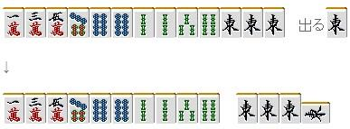

# 鸣牌 6—杠（二）
  1.手牌烂的一比

那怕还是在序盘，上面这样的手牌也不应该杠。 这样的恶形，自己和牌可以说是令人绝望的。  杠的话会使宝牌增加， 在他家可能和牌的牌局增加宝牌，明显是不值得的行为。  这样的手牌从字牌开始切就可以了 或者想到弃和的话，切掉 5 索也是可以的。

 2.使自己听牌变差的时候

 下例是就算听牌也不应该杠的代表。

清一色的听牌， 摸到能够杠的 6 索就应该快点切掉。 确实能岭上开花或者中杠宝牌能够有跳满以上 但是失去了 5 索的听牌，依旧还是不应该杠的。

 3.使手牌进张减少的时候

 好形的一向听，虽然杠也没什么关系 但是例 3 的情况有些不一样。 56666 可以看作 56+666 很容易理解，这里会有 47 的进张 这里万子是一个二度进张，这里切掉 2 万确定断幺的一向听是最好的了。 要是再摸到 3 万或者 5 饼的话，就可以暗杠然后立直了。

例 4 的情况，从听牌机会来看杠牌也没什么 不过当两面进张的时候会变成单骑听牌从而消除了平和 这里还有 789 三色同顺的可能，摸切是最好的。

 4.有人立直的时候

 他家立直的时候， 不管手牌好坏，基本不要去杠。  其理由是： 1.立直的人有受到杠宝牌的恩惠的可能。 2.有人立直=自己的和牌率降低  不过也还是有例外的： 1.自己也门清听牌的时候 2.门清好形一向听可以暗杠 3.即使副露了，能够保持优秀的听牌，且杠牌能够给予打点巨大的提升的时候（比如3900→7700） 4.其他少见的情况

 5.自己遥遥领先的时候

自己是 TOP 的时候，给予对手机会的杠是需要自重的。 特别是自己遥遥领先的时候。

 6.门清的大明杠

杠！  这个就太乱来了 即使已经副露，没有听牌的大明杠也是不应该的。   （待续）