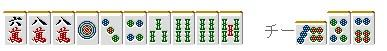

# 鸣牌 7—鸣牌与向听数

鸣牌与向听数：
通过向听数，我们可以很容易地了解我们的手牌距离和牌还有多远， 这是非常重要的一个概念。 这里我们来说说向听数与鸣牌是否妥当的关系。

 不改变向听数的鸣牌

 由于鸣牌会放弃一次摸牌机会。 鸣牌却没有让手牌前进是不行的。

这样的手牌，碰 3 万或者 4 万向听数不会改变，手牌没有前进。

基本上可以说“不改变向听数的鸣牌是禁止的”  【例外】 已经听牌的手牌，鸣牌要是能够让听牌更加优秀 或者是对打点能有提高的情况是应该鸣牌的。

例 2 的手牌，6 饼或者 8 饼的吃能够改变听牌 根据场上的情况，碰 2 万或者吃 5 饼也是 OK 的。  【例外 2】 虽然不改变向听数，但是能够更加容易和牌的情况。 具体来说，就是和断幺或者对对有联系的手役了。

例 3 的手牌与其去做门清，鸣牌断幺要更加容易了。 即使没有改变向听数，鸣牌也是没有关系的。

例 4 是七对子的一向听， 要是能够碰的牌打出的话就碰，向着对对前进吧。 对对要更加容易和出一些。

 副露数与向听数

 越是鸣牌，自己放铳的危险就越大，而且有效牌也会有所限制。 因此，手牌乱七八糟的时候鸣牌可不是什么好决策。

就像例 5 一样，越是鸣牌手牌越烂的新手是很常见的。

3 次副露就应该听牌了，弄成两向听就太不像话了。

鸣牌前：
 鸣牌前是这个形的话，上家打出 5 饼的时候就应该忍住。 本来就是比较痛苦的形，鸣牌之后和牌的可能形就更低了。 已经有人立直的时候就更要有所准备了。  为了能够直观一点，  三副露：听牌、要是一向听的话也要有满贯的手牌（比如清一色） 两副露：一向听以上，两向听要是给力的好形，打点要有 3900 点。  像这样定一个标准，鸣牌的精度就会上去了。

比如这种手牌，吃了 47 索还是两向听，打点也低。 不能说是很妥当的鸣牌。  要是嵌 8 饼的话也不算太坏吧

  （待续）