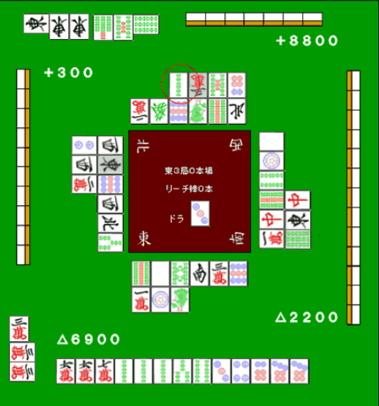

# 鸣牌 8—食断

食断：
由于断幺可以鸣牌，是一个很给力的手役。 但是不管断幺如何容易和牌

这样的手牌在序盘鸣牌的话就只有 1000 点了，这是不应该的。

好不容易有一手好牌，鸣牌的话太浪费了。 那么，要什么情况才该鸣牌呢？

 宝牌或赤牌有 2 张以上

 有 2 张以上宝牌的话，考虑到打点也没必要强凹门清。

例 2 的话就切掉 1 索确定断幺。

出来的话就毫不犹豫地鸣牌。
有张宝牌的情况就应该两下鸣牌断幺和牌。

 和牌就 OK 的情况

 AL 第二，和 TOP 有微弱的差距。 即使是平常不应该鸣牌的一些好牌也应该去断幺 1000 点。

即使是这样的手牌，也有鸣牌做断幺的时候。

也许有人觉得鸣牌太可惜了。 但是如果是以胜利为目标的话，鸣牌也是必须的。

 门清来不及的时候

 鸣牌厉害的人，鸣牌方式自然不用说 “鸣牌时机”也是很重要的。

例 5 是可以满贯的牌，但是任何手牌和不了牌也都没有价值。 这个牌目前还是两向听，距离听牌还需要花上一些时间。 随着巡目的深入或者是他家速度很快的话， 放弃门清而鸣牌也是有必要的。

 上图的情况的话，2 索就应该要碰了。 虽然很想门清立直一口气把失去的点数打回来 但是已经两个人副露，没时间再等了。  特别是亲家需要连庄的时候。 需要比子家更加早的对鸣牌做出判断。 悠闲地去做牌的话，说不定就会丢失一个珍贵的亲家了。  嗯，以上都给出的是好形的例子 那么恶形该如何呢？

即使是打错了，这种牌也是不应该鸣牌的。 确实这个牌不去断幺应该没法和牌。 但是像这种“断幺是否能和都不知道”的垃圾牌 还是悠着点打门清吧。

这种牌要鸣牌也应该是南局亲家，要是这个亲家没了就 4 位确定 这种被逼到绝境的时候。 要是有人立直的话就非常危险了。 在东局就鸣这种牌可以预料一下自己的下场……  牌型很烂，打点又不高的牌是不能鸣牌的。 尤其是食断这种防御力低而且容易放铳的手牌。  已经鸣牌的话向着和牌前进是很重要的， 1000 点、2000 点的食断还是形比较好的时候才干吧。    （待续）