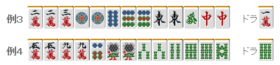

# 鸣牌 9—对对

对对：
对对是初学者很喜欢的一个手役。 但是这个手役失败的例子却是屡见不鲜。  特别是网络麻将，在能够碰的牌出来的时候会有停顿。 很容易不管三七二十一就鸣牌了。  通过本次讲座，希望大家能够对鸣牌有一个新的认识。

 应该做对对的情况

比如这个手牌，有没有从不是役牌的北开始鸣牌的人呢？ 这就是典型的“乱鸣牌”。  即使全部鸣牌成功，最后裸单骑也只有 2600 点。 4 万和 7 索是中间的牌，不容易鸣牌。鸣牌反而会适得其反。

 这样的牌要是别人立直的话，你不觉得很苦逼吗？ 只有 4 组对子就去做对对有点欠缺考虑。

 应该做对对的时候，要像例 2 这样对对的材料比较齐全的时候。 具体的说就是刻子和对子加起来要有 5 组。  像这样的手牌就可以去做对对了。 例 2 的牌，也不用等着白出来，3 饼出来的时候也应该积极的鸣牌。

 很微妙的时候就是对子 5 组的时候。 因为这个时候也是七对子的一向听。  这个时候要做对对需要碰 3 手（如果已经出来一张能碰的牌就还需要 2 手）， 如果这个时候碰的话，向听数就会增加 1。  但是七对子从一向听到听牌也是需要花费一定时间的手役。 要是自己有比较容易碰的牌，做对对要更加快速一些。

例 3 就是应该向着对对或者全带前进的手牌，除了 4 万，其他的牌都应该鸣牌。 与此相反，例 4 即使鸣牌，剩下的形比较难受，因此还是坚持七对子比较好。  当然注意场上打出的牌也非常重要。 如果手牌含有场上已经打出 2 张的“死对子”，自然是应该坚持七对子。

 四暗刻的一向听该怎么办？

像例 5 这样，已经到了四暗刻的一向听。  6 饼出来了，要鸣牌吗？ 也许有人会先忍一手， 如果是我的话“即使是第一张牌，我也要碰听”  虽然这个还与是否有祝仪有关， 但是不去听自摸就能够满贯的牌，我觉得有点优柔寡断了。  去博四暗刻的话，也应该是落后很多的 4 位等 十分需要点数的时候不是吗？

 做牌过度是要禁止的

比如例 6 的手牌，摸到 3 饼或者 4 饼应该选择对对的双碰听牌 8 万出来的话也要鸣牌，选择高目的对对 3 饼或者 4 饼听牌。

但是例 7 的手牌，1 万出来的时候就不能鸣牌了。 不仅听牌数会大幅减少， 3 副露的话，他家估计就很难再切出万子了。

这个手牌打点已经很不错了，减少自己的听牌数去做对对就有点过了。 有 3900 点的牌就应该以和牌优先，大家要把这个记在心中。    （待续）