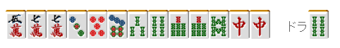

# 鸣牌 10—混一色

混一色：
 混一色是凑齐同一种数牌和字牌就可以简单达成的手役，在初学者中有着很高的人气。 实际上混一色不仅做法简单，而且打点也很给力。是很有制作价值的一个手役。  混一色的差距主要体现在鸣牌方式和牌形的理解上。 常常会看见该鸣的牌没有鸣，不该鸣的牌又鸣从而错过了和牌机会的人。

 不应鸣牌的手牌

  即使鸣牌，混一色也有 2 翻。 没有必要死凹门清。  那么，不应该鸣牌的例子到底是哪些呢？

像例 1 这种，门清已经足够听牌的手牌 鸣牌的话就成了“白痴混”（即鸣牌混一色 NOMI） 不到万不得已还是应该打门清混一色。 另外就是，例 1 摸到万子的任何一张都能够听牌 虽然是一个比较极端的例子， 但是只要是门清混一色的好形一向听都有门清听牌的价值。

例 2 的形，东和北场上都已经切出了 2 张。 这种情况也是常有的。 “大丈夫だ，問題ない！”而去碰牌的人也不少 有死对子的情况去做门混七对子才是比较好的策略。

这是失败最多的一个例子 就是像例 3 这样面子还没有好好凑齐的时候了。

还是稍微在门清的时候把形调整好一点在鸣牌吧。 剩下的形实在是太苦逼了 他家立直的话不仅没有反击的能力， 失去安全牌的西，损失实在太大了。

 应该鸣的牌，应该放过的牌

 混一色鸣牌的要点是和手牌分不开的。

例 4 有一张牌不能鸣的牌。 那就是 3 万。

碰了 3 万的话，2 万和 5 万就会变得非常不好用了。 最后要是和成了混一色对对的跳满的话 也仅仅是“偶然” 更多的时候还是会错过了和牌的机会。

我们要控制自己给自己制作愚形的行为。

例 5 只要鸣牌就可以听牌了， 但是为了听牌也不是“随便什么都应该鸣牌”

不管那么多先听牌吧（笑） 要是他家手里用着一张 7 饼……

这也是“出来就鸣牌听牌” 但是如果是上家打出的还可以吃啊……

 在这里，一个重要的事情我说了两次。  不管三七二十一的鸣牌，千万要杜绝啊。
鸣牌 11—后付（1）

后付1：
 假如你拿到图 1 的手牌。

这里碰中，是比较普通的鸣牌（图 2）

和上家打出 4 饼或者 6 饼相比，鸣牌的话就会形成翻牌后付形。（图 3）

这里我们比较一下图 2 和图 3， 和牌的容易度其实没有什么大的差距。  确实，图 3 的牌，中不出来就和不了牌。 虽然有他家也拿着 2 张中的可能 但是实际上这种可能性也不是太高。  为了保险起见，摸到 4 万的话可以向着断幺前进。 剩下的形也不坏，和牌也不是很难。  另外，要是有人立直的话 图 2 的牌就会比较困难了。  图 3 的话还可以拆掉中撑 2 巡。 虽然很多人不喜欢后付，但是根据手牌还是可以适当进行后付。 不要后付的时候就可以拆掉役牌。  以防御力优先的鸣牌，我们要有这个意识。  赤牌的速度麻将中的后付也是很常见的。  虽然图 1 那种牌不用勉强后付，

但是这种有赤五饼的手牌，鸣牌就有 3900 点的话 放过上家打出的 4 饼或者 6 饼 对于速度的感觉就有点薄弱了。  应该后付的牌，也要是宝牌有 2 张以上，不用门清也可以获得高得点。 有宝牌的手牌以速度优先才是符合理论的打法。

实战中要是拿到图 4 的牌，能够鸣牌的牌都应该鸣牌。

假如在东场的亲家拿到图 5 的手牌， 应该采取什么样的方针去打呢？  亲家满贯确定的牌，可以鸣牌。 但是这也只是“菜鸟杀手”的打法。 在上级者对局中就不那么有效了。  1 万和 7 索基本上还是不要吃的好。 如果是很想和牌的一次机会，我们要控制暴露役牌后付。 暴露的话，傻子才会打發，就连东也会给你封死的。

这样的副露，会打宝牌的发以及双东的人应该都是初学者吧。  图 4 的牌的话，不管鸣什么牌都看起来像是断幺 因此从哪里开始鸣牌都是可以的。    （待续）