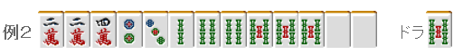
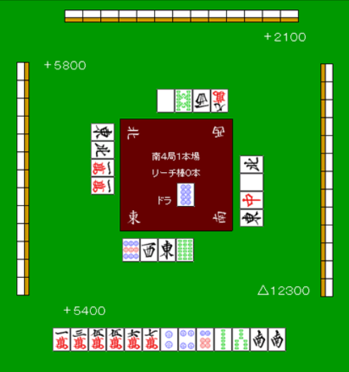
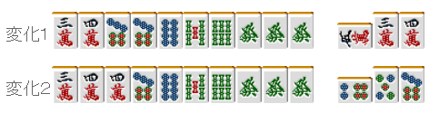

# 鸣牌 12—后付（2）

后付2：

前一回主要说了有 2~3 张宝牌的时候，即使是后付也应该积极的鸣牌。
其实还有其他的手牌和场况，采取后付是比较有效的。

急需的牌出现的时候

比如这样的手牌，上家打出了 7 索。 毫无疑问，这张牌是我们急需的。
要是这张放过了的话就只剩下 2 张了（还有一张是宝牌表示牌）
要自己摸到两次 4 索和 7 索应该是相当难的。
所以这里就要边张吃进行后付。

之后早点处理 6 万和 4 饼，留下一张安全牌即可。 另外，要是摸到另一张役牌的话还是把它留下更好。

虽然这里后付了，
更多情况他家也不会扣牌，需要的牌还是会出来。
相反，对手有压力的话也不会贸然进攻。
副露宝牌的面子也不怎么影响防守力
这是完全没有问题的鸣牌。

二手准备的后付

仅靠役牌的手牌是不好鸣牌的。
但要是有三色或者一气的话会更加有效果。

例 2 的手牌，3 万、4 饼、3 索出来的话当然是吃，把天枰向三色和役牌倾斜。

例 3 的手牌一饼出来的也有碰的一手， 不要太担心自己会搞的自己和不了牌。
摸到 6 饼或者 8 饼可以向对对三暗刻变化。

无论如何都想和牌的胜负关键

在南场，常常会面对无论点数多少都想和牌的情况。
ALL LAST 有微弱的差距，和牌即逆转的情况是典型的代表。

例 4

根据例 4 的点数情况，等着南出来太过优柔寡断了。
虽然鸣牌之后手牌会有点散，但也要朝着这 1500 点去。
这个牌能鸣牌的时候都鸣了吧（当然 5 万的碰是不行的= =）

像这样 ALL LAST，拼命地向着和牌前进
要比对手更快的话，就没有被手上的役牌束缚的闲心了。
正是这样，后付成为有效的战术。

鸣牌 13—鸣牌的技巧（1）

鸣牌的技巧1：
实战中有用的鸣牌技巧我分为 3 次来介绍。 有些知道这些小技巧的人也许会去胡乱使用，  不过在没有习惯这些技巧的时候，有时会没有想到去”鸣牌“ 或者会产生对鸣牌的抵触感。  不过记住这些技巧是没有损失的， 一定会有派上用场的时候， 特别是在赤牌麻将中，这些技巧会成为有力的武器

 食いのばし(食い延ばし,没想到什么好的译名，各位读者有好的建议请留言)

 这是通过吃来让面子增加的技巧。 在混一色时经常用到。

比如这样的手牌， 要吃上家打出的 3 万，就要用的这个技巧了。

 这样就能成功地做成万子下部的两个面子了。 像这样的鸣牌，对断幺也是很有用的。

这是一个门清能够做到跳满的牌，不过实战中上家切出索子就应该吃牌 改做断幺宝牌 3

比起自己去摸

吃牌去形成的一向听，单纯计算的话有着几倍的听牌的速度。
 好不容易的手牌，不和牌就没什么意义。 像例 2 这样的满贯手牌，要随时做好吃牌的心里准备。

 双重面子的处理

 这是利用连续的对子形成两组面子的技巧。

 有役牌的暗刻，人们会有“太浪费了”而想去做门清的想法。 这是人之常情  就例 3 的牌会有很多人去门清做三暗刻或者万子的一杯口 从而把 4、7 索放过了。不过我觉得这里是关键的地方，应该鸣牌。  这个手牌的关键牌是 2、5 万和 6 饼，要是上家打出来了就鸣牌吧  我用牌理再说明一下， 3344 万和 5778 这种是二度进张的愚形， 这样的愚形通过鸣牌可以消除， 鸣牌之后就会变成非常清楚的形式了。（变化 1，变化 2）

不仅仅进入到可以吃听的一向听这么简单， 变化 1 的情况，要是上家再次摸到 2、5 万，切出来的机率很高。 变化 2 也是一样，6、9 饼也会变得很容易鸣牌。 正式以上的理由，可以通过鸣牌消除二度进张的时候，应该尽可能的鸣牌。

 但是，也要注意一下理牌。

这个手牌，上家打出 1 饼的时候，A 君很高兴地吃~ 结果之后 1、4 饼就没有出现过而导致流局，这是神马情况呢？  那么其他人对这个鸣牌是怎么看的呢？

 ↓ 吃~

↓

↓

↓

 ←边上这两张牌不用说也知道是什么了
吧。 这样的手牌，留着饼子下部的牌已经是完全暴露了= =  “1、4 饼是关键，要不就是 2 饼的嵌张或者 3 饼的边张了” 在上级者的眼力，这个牌就成了透明的听牌了。  A 君在鸣 1、4 饼之前应该花点功夫把牌理一下。

本次介绍的食いのばし和消除二度进张的鸣牌，有时会使手牌留下不自然的形。 如果习惯了的话，就要事先想好要鸣的牌，然后对手牌进行适当的理牌或者在吃之前早点把要副露的两张牌放到自己右边。  （待续）