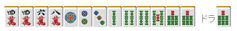
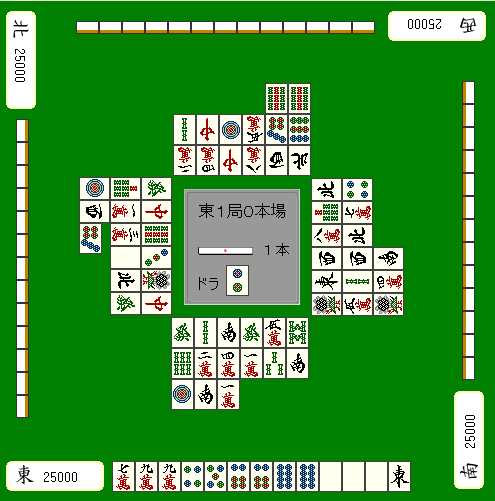

# 鸣牌 14—鸣牌的技巧（2）

鸣牌的技巧2：
这次来介绍针对食断的高度技巧。 也许有人说这是小牌优先的技巧， 但是现在的赤牌麻将中，差距就是从这些小牌优先的技巧中体现出来的。  以前的花形手役三色到现在已经完全成了配角  导入赤牌之后站在台前的自然是断幺 食断的速度对其他手役是有压倒性优势的， 配合上赤牌也是能够有高打点的最强的手役。  图 1  东一局亲家第 6 巡手牌

即使是这样的手牌，也是可以考虑食断的。 立直的进张比较窄，等着万子和饼子两方的转手就会太迟了。

上家打出的话就吃。
饼子和索子各构成一组面子，剩下就是一直线做下去就好。 即使有效牌张数没有改变，但也要充分利用上家的捨牌。 速度要比门清快多了，要是再摸到一张赤牌就能够轻松满贯。

 （变化之后的形……例 2）

图 1 的牌不要去想 234 或者 456 的三色同顺， 你不觉得最高形是很无聊的吗？ 与其画饼充饥的断幺三色， 想想更加现实的食断更加重要。

 图 3  东一局北家第 5 巡手牌

宝牌 3，立直怎么样？（默听更是不予讨论） 不管是速度还是打点来看，这里切 9 索才是最好的。

鸣牌可以有好形听牌，
（宝牌碰比较少见，不过要是出来了反应要快）  再加上 3 饼、7 饼、7 索可以打门清， 所以这里就算不听牌之后也能钓上大鱼。

 图 4  东一局西家第 9 巡手牌

假如上家切出 7 万的话…… 一边想着“已经看到 2 张 7 万了……”却还是放过它把手伸向山牌的话 这就太慢了……应该用 6、8 万的嵌张吃牌做断幺。

即使是门清听牌，听宝牌表示牌的话太过显眼， 立直之后，作为宝牌旁边的 7 万首先就不会被打出来。 要自摸的话，自己也都知道只剩下 2 张了，期待很小。 我们没有必要对难以和牌的门清这么固执。

 图 5   东一局亲家第 8 巡手牌

“不是吧！？”也许你会这么说，没错，这个牌也可以做断幺。 如果是我的话，4 饼出来的话我会食替（如果不能食替的话就切 2 索） 3 索出来的话就吃，然后切 1 饼。  这个牌要门清还是有点痛苦的， 这样的巡目和牌型，即使立直能够成功和牌也是相当困难。 应该考虑碰、吃，寻求断幺这条活路。

    有宝牌和赤牌很想和牌的时候，或者是无论如何都想连庄的时候，食断都是有效的手段。 不喜欢鸣牌麻将的人现在虽然还是很多，说我们很“下流”= =，但是都这个时代了，这种自己打牌太慢的抱怨，我们还是无视好了。这样的手牌敢鸣牌的人才是强大的，至少我是这么认为的。
鸣牌 15—鸣牌的技巧（3）

鸣牌的技巧3：
在鸣牌技巧的最后，来讲讲不以自己和牌为目的，而是阻止对手和牌为目的的一些鸣牌。 进行这些鸣牌的时候有人会觉得很不舒服，所以实战的时候要注意。

 破一发

 立直之后有人鸣牌的话，就会消除其一发的权利。 一发的概率本来就不高， 所以没有必要担负着风险去破一发。

 如果是零风险的情况，破一发是比较可取的。 就像上图的情况，去强行听牌有点勉强了。 那就把 7 饼吃了拆掉白的暗刻来破一发比较好。

 干涉碰

 吃和碰同时发生的时候，基本是以碰优先。 （如果吃的发声明显比碰要早的话有时会以吃优先） 因此，可以用碰来妨碍对手想要吃的牌。

 转移海底、消除海底

 自摸海底（这一局最后一张可以摸的山牌）的话会有一翻， 终盘要是有人立直的话，能够消除海底的时候还是尽量消除。  特别是和牌之后会连庄的情况，仅仅是让亲家少摸一次牌就很不错了 即使想要在终盘寻求形式听牌 也要注意不要乱去吃牌给立直的人多摸牌的机会。

 不以和牌为目标的杠

  想杠就杠是初学者的做法， 了解杠的隐藏作用可以获得很多好处。  比如下家立直，且下家会摸到海底。 这时要是自己有杠材的话，那就等到自己摸最后一张牌的时候杠。 杠之后会移动海底牌，立直者的摸牌和海底都被消除了。  由于杠会使对手增加宝牌， 自己已经副露的时候要尽量避免去杠。 但是，即使自己是 4 位也有开大明杠比较好的时候。  这里杠并不是期待杠宝牌， 而是让局面膨胀，使他家能够有大牌。

利用对手的打牌把别人的点数打下去从而能够改变顺位。  哪怕是第 2 位，和 TOP 差的点数不多而且是 TOP 是亲家的时候。 第 4 位立直之后开杠的战术也是有的。 目的是利用亲家かぶり（子家自摸的话，亲家会比子家多出一倍的点数）改变顺位。 但是自己要有足够的安全牌， 而且不担心第 4 位反过来逆你的时候。  条件齐的时候，这些杠法也是可以考虑的。

第六章：立直
立直 1—立直的优点与缺点

立直的优点与缺点：   立直是非常特殊的手役。 不仅没有形的约束，还有一发和里宝牌等奖励。 实际上看就有 1.5 翻的价值，而且是麻将中最容易做成的手役。 目前的讲座劝诫大家： “不要太拘泥与手役，要尽可能快速的听牌”  现代流是重视速度的打法， 没有手役的小牌很多，其不足就由立直的得点力来补充。  我们先来确认一下立直的意义吧。

 立直的有点

  ·很容易就能成役。

 麻将没有役是不能和牌的，也就是“一翻缚” 立直可以简单地搞定“一翻缚”，只要不鸣牌就好了。 像图 1 这样的宝牌 3 的牌，不立直的话就只能自摸才能和牌，所以当然应该立直。  ·有一发和里宝牌的可能性 没有役和宝牌的立直 NOMI 的手牌，立直和牌后运气好也有达到满贯的可能性。 一发自摸再中一个里宝牌就是满贯，里宝牌是雀头不用一发也是满贯。 最近的免费雀庄对一发和里宝牌的祝仪很多，这玩儿的是很大的。（注：这里的满贯包括了切上满贯，即 30 符 4 翻和 60 符 3 翻的手牌。）

 ·让对手不能自由地打牌 提高得点并不是立直的优点，因为立直之后通常大家都会变的很慎重。 会有兜牌和弃和的人。这样一来，自摸的可能性就变高了。 让别人不能自由地打牌，这才是立直的一个优点。  具体的说，四暗刻要立直就是典型。 打点已经很充足了，立直的目的就是延长巡目，提高自摸的可能性。  ·让对手知道你听牌，而去追求荣和。虽说通常情况下立直之后铳牌很难被打出来，但也有利用自己的捨牌去追求荣和的时候。 筋牌引诱和听字牌也是能够和牌的。 七对子听已经出现 2 张的字牌的话（也就是地狱单骑），还是立直比较好。

 立直的缺点

 ·必须拿出 1000 点点棒。 也许你会觉得 1000 点不过是个小数目，不过 AL 和第二位差 700 点的 TOP 的状况这就是一个很大的数目了。 拿出 1000 点，这个时候就变成第二位了。 结果 3 位或者 4 位和牌的话自己就以第二位结束了牌局。  ·让他家知道自己已经听牌，荣和的期望不高。 本来能够拆的面子面对立直，太危险的牌是不会切出来的。 实在想要和牌的时候还是默听比较好。  ·立直后除了所听的牌以及能够暗杠的牌，所有的牌都只能摸切。“立直是暴牌宣言”，也有这么一句话。 立直之后，除了所听牌和能暗杠的牌都必须摸切。 所以，即使有人碰了发和白，你摸到中也必须切出去（注：铳了大三元不是脸太丑就是活该啊= =）  ·不能改变手牌。

摸到 1 饼就是纯带三色，5 翻以上的牌……但是 立直了也只能把 1 饼切掉。  综上所述，立直有优点也有缺点。

所以立直的判断是需要考虑的。   （待续）