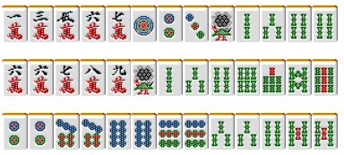

# 立直 4—立直？还是默听？（3）

立直？还是默听？（3）：  前回讲到，好形听牌可以毫不犹豫地立直。 那么听牌不太好的时候我们又该怎么办呢？

 无役听牌

 首先是没有役听牌的情况，来看看是否需要立直。

 如果像例1这样的牌我觉得还是立直好。 如果他家没有什么特别的动向就是“应该立直”的。  因为这个牌能够改良的牌就只有6万。 虽说摸到9万可以改成容易荣和的双碰听牌。 不过这也不是什么很给力的变化。  “与其期待摸到6万，还不如摸8万”，不是这样吗？  而且摸到5万和6万的概率是一样的， 如果先摸到了5万，之后再摸到6万就会振听了。  与其摸到5万之后再立直，还不如听牌的时候就立直。 立直还有能够让对手不能自由打牌的优点呢。  有2~3张宝牌的时候，边张或者嵌张立直也无妨。

 心中有向好形听牌的方向发展是没错， 不过最后形成了愚形听牌也是没有办法的。  虽说两面是很容易和牌，不过也不是说和牌的容易度就是两倍。 边张和嵌张能有“引诱”（比如立直之后摸到了6万）和 ONE CHANCE、NO CHANCE（例2的话比如场上已经能见到3张以上4万和5万）。遇到这种情况也还是有被打出的可能性的。  基本上，没有役的愚形听牌 有1张以上宝牌是应该即立直的。 因为立直对于得点提升的优势很大。  总结： 无役有宝牌和赤牌的愚形听牌立直是上等选择。

但是，也有默听比较好的情况。

 如上图，仅仅两巡就已经有宝牌2的听牌。 这里不立直等待手牌改良是比较有利的。  “还有16巡，应该能够和牌吧”这样想就太过乐观了。 嵌6万的听牌不仅太过苦逼，这个牌还有很大的改良余地。

摸到万子的可以改成两面。
碰宝牌听四连形也是可取的。  自摸6万的话，也有“1300~2600”，也不算什么大的损失。 这样改良比较丰富的手牌，默听也是考虑范围之一。  没有宝牌的情况： ·立直的得点提高效率不太高 ·先默听，有人立直的话还能有弃和的选择。  根据这一点，也应该向默听发展了。

 基本没有改良期待的时候可以立直，有3种以上改良进张的时候选择默听多数会更有利。  这个边界的判断就很微妙，虽然都统称愚形，但是和牌的容易程度也是有差别的。所以不能统一的理论化。 这种微妙的判断是受场况和点数影响的。理论化的意义也不大。

 不过有一个需要记住的是，例3的牌除了默听和立直之外，还有不听牌的选择。  是平场的话，这个牌应该切掉1万不去听牌。 不仅仅是索子，宝牌周边的万子以及形比较好的饼子都还有延伸的空间，立直仅仅取1300点实在是愚蠢的策略啊。  不听牌使用的情况是很多的，是非常重要的技巧。

 有役听牌

 有役的情况，默听也可以和牌。 这样的话，手牌变化还很多的时候就默听好了。

例4能够改良的就只有5万了， 只要宝牌不是8万就应该立直。 （宝牌是3饼的话，也有默听的情况）

例5有着各种改良，先默听，摸到再立直就好了。

但是，有些手牌要改良的话手役也会随之消失。

 这样的情况， 默听有5200就默听，2600的话就立直。把这个记住就 OK。 即使听牌不太好，好不容易有一手牌，拿个2600就太浪费了。 即使是边张或者嵌张也应该立直。  有5200也可以立直， 这就可以根据场况和点数自己看着办了。   （待续）