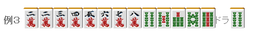

# 立直 5—立直理论（1）

立直理论1：   本次来说几个与立直有关的基本理论。

 即立直是基本

  新手中经常见到的是， 默听了好几巡，然后突然摸切立直。

虽然一手就可以变化为三色同顺， 这样的牌要是听了就不要纠结，立直吧。  虽然有4饼和1万两种改良，但这里等是不利的。 有的理论表示“改良张数>和牌张数”的话就默听， 不过这是太过古老的理论了。  要是别人打出了你不能和的2饼就太苦逼了。 因此一巡都不要等，立直！

 这个牌立直也是正确的。 默听放过低目，观察几巡再立直都是损失很大的选择。  你可别告诉我你是在等一发 因为立直越迟，一发的几率就越小。  理论： 听牌时立直和默听的判断 要立直就马上立直， 默听的话，只要场上形式没变就保持默听。

 自摸的基准

  “这种听牌是不会被打出来的” 这也是导致新手和牌困难的消极思想。

 即使是宝牌周边的牌，切过2索或者7索的话就明摆着立直吧。没人打出来就自摸， 反正两面的自摸的可能性还是很不错的。

 这是更加难被打出的宝牌边张听牌。 默听等待一杯口成形就是太消极的打法了。 荣和确实有些令人绝望，不过还是有自摸的可能的。 运气好自摸的话就有1300~2600点，是应该立直的。  除了单骑听牌，不用把“自己所听牌是否容易被打出”作为立直与否判断的材料。 不管什么听牌，对手在胜负手该切还是会切。 或者自己被对手逼到弃和的时候，从对手的捨牌分析的“可能会和的牌”就不是那么容易被打出来的了。  与其考虑这个，还不如以自摸为基准，想想自己所听牌的张数会比较好。   （待续）