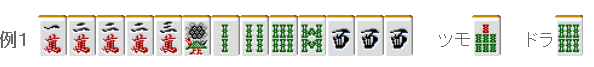
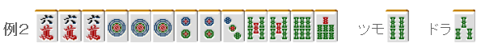
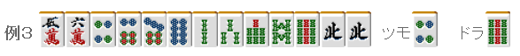

# 立直 6—立直理论（2）

立直理论2：

 かけるは内、のばすは外（太专业了= =，没想好怎么翻）

  比如124索这样的形， 摸到5索，从两面的角度考虑切掉1索是理所当然的打法。 但是，要立直的话就不一样了。

这样的牌大致可以立直了。 要立直的话，打4索才是合理的。  要是场上已经有现物的4索，3索也会更加容易被打出一点。

但是这也不是非常有效果的。 4索要是非常危险的话，切1索立直也是可以的。

 暗刻优先

这样的牌切2饼和3饼都可以立直。 像这样没有平和的牌应该保留暗刻立直。 摸到1饼可以暗杠，不仅可以增加符数，还有可能增加宝牌。

 情报要少

 以前流行的迷彩战术（给捨牌中设下陷阱）受到了压倒性的否定。反而是捨牌越没有特征越好。

例3是典型的立直手牌，应该用4饼替换雀头，切北。 这里要是切掉4饼的话，立直之后。

他家会很容易切出
 切掉北的话，他家也只能知道你不是单骑听牌而已。 捨牌是幺九牌这种没有什么特征的牌可以说理想的捨牌。 比如：

这样的立直话，对手只能对日 相比不靠谱的迷彩战术，有着“强大的河”更加容易荣和。    （待续）