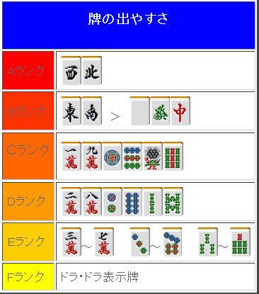

# 立直 7—立直的听牌取向（1）

立直的听牌取向 1：  接下来将要分两节，来讨论一下立直的听牌取向问题。   【判断 1】张数  当张数有差距的时候，应该尽量选择张数更多的听牌。

虽然可以切掉 7 索听 2 索， 不过 4 张听牌比起 7 张听牌，果然还是切掉 1 索立直才是正确的。 所以最好是记住这种索子的牌型，记得越多对以后用处越大。

 【判断 2】点数听牌张数没有差别，那就选择得点更高的。

切 2 饼、4 饼、6 饼都同样是 4 张的听牌。 这样的话就切掉 4 饼立直，自摸能有三暗刻。 记住饼子的牌型，对以后有帮助。

 【判断 3】所听牌被打出的容易程度

 这个牌切 4 饼是 3、6 饼听牌， 切 5 饼是 1、4 饼带 1 索听牌。 听牌张数都是 7 张，而且对打点也没有影响。那么应该选择什么听牌呢？

 牌被打出的容易程度（也就是荣和的容易程度）是有差别的，如上图。 严密的讲，3~7 也是有差别的。不过差别较小也就不用去管了。 从牌理的角度来讲，越难派上用场的牌越容易被打出。也就是说，幺九牌是比较容易荣和的。  例 3 的牌，3、6 饼属于 RANK E 的，比较难被打出。 所以就应该选择切掉 5 饼立直，听比较容易被打出的 1、4 饼带 1 索听牌。

牌被打出的容易程度是很重要的，明白这一点的话各种局面都能够 HOLD 住。 例 4 的牌从效率上来讲，摸到 5 万可以形成两面，貌似切掉 8 万比较好。 不过单纯从被打出的容易程度来看，9 索和 8 万的双碰听牌绝对是更加容易和牌的。 重要的知识在实战中要多加利用。

 嵌张听牌和双碰听牌相比，双碰听牌基本上更加有利。

 例 5 的牌，场上没有常什么特殊情况，切掉 9 索立直要更加容易和牌。 要说为什么的话，稍微知道怎么打牌的人都会针对立直来选择打牌。 当不是两面的听牌立直的时，常有根据立直之后的捨牌打出铳牌的情况。 比如根据筋或者壁打出铳的情况。（请参考第七章）  这样的双碰听牌， 诱饵就有作为筋牌的 5 饼和 4 索，还有作为 34 饼 56 索的壁这 6 种牌。 如果选择嵌张的话，只有 567 索三种“立直后的有效牌”。 而且切掉 7 索立直，不管场上打什么牌 8 索都会被警戒。  由以上理由，双碰听牌和嵌张（边张）听牌之间的选择 双碰立直才是符合理论的。 但是，嵌张听牌有利的局面也很多，那种情况我们要圆滑的应对。    （待续）