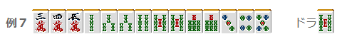

# 立直 8—立直的听牌取向（2）

立直的听牌取向 2：  那么，前一回我们单纯地比较了听牌的取向， 这一回我们来看看“张数少的高打点，张数多的低打点”该如何进行听牌的取舍。

1.打点有微差

比如这样的情况，应该切掉 1 万立直。 3900 和 5200 点（立直一杯口）的差距的话 选择张数多的要好的多。

2.1 翻的差距

这次的打点就有一倍的差距。（2600 和 5200） 但还是切 1 万更好 张数有一倍的差距的话 打点只有一倍提升也不要选择。  立直和牌的情况下，还有中里宝牌的机会。 这个时候，由于“满贯的天井效果”，两者的打点差距其实也就没有一倍的差距了。  具体的说，自摸，中 1 个里宝牌 立直+自摸+宝牌 2 和立直自摸一杯口宝牌 2 几乎没什么差距。  而且麻将是存在“负的期望值”的。 减少自己的听牌张数，就增加了对手和牌的概率。这个缺点也是存在的。  特别是追立的时候， 应该优先选择听牌张数多的听牌， 听牌张数越多，对日的时候才会更有利。

例 3 的手牌，在有人已经立直的时候，切掉 5 饼选择 36 万听牌是非常损失的选择。 万子的三面张听牌才是关键。

例 4 的牌可以选择两面平和，嵌张三色立直和三色默听 这个情况选择什么都没什么错，不过我还是会选择切 1 万立直。 当然 5 万比较薄的时候可以选择三色。

3.2 翻的差距

 最微妙的情况就是相差两翻的时候了。

例 5 与例 4 稍有不同，没有了平和 这样的情况有无宝牌就是关键。

☆没有宝牌的情况 好形的 1300 点与 5200 点的话，那还是愚形的高打点要有利一些。 没有宝牌又有两翻的差距就应该选择手役。记住这个就好。   ☆有一张宝牌的情况（或者是有断幺等加一翻的情况）  两面立直、愚形默听、愚形立直都可以 期待值并没有什么很大的差别，根据局面进行判断吧。  ☆有两张宝牌的情况 推荐两面立直或者愚形默听（5200 点的两面或者满贯确定）

但是这样的牌，高目的牌在 3~7 之间，比较难被打出。 所以就选择两面立直吧。  ☆有三张宝牌的情况  打点已经很充分了，应该选择好形立直。

4.3 翻以上的差距

 这些情况几乎都是应该选择高打点。

例 6 当然是应该选择纯带立直。 5200 点的默听也可以 不过选择 3 面听牌的话就太消极了。

但是在保证听牌宽度的情况下已经有足够的点数就不要太草率了。  例 7 切掉 2 索就太贪心了。 好不容易的机会，因为太贪心而错过了和牌的机会就太苦逼了。

宝牌表示牌 4 索等是最坏的听牌。  那是切掉 5 索默听偷偷和牌呢？ 还是切掉 5 索立直呢？  即使 5 索是一张危险牌，如果山牌还有很多牌摸的话 我觉得这里切 5 索立直的胜负手是更加有利的。  （待续）