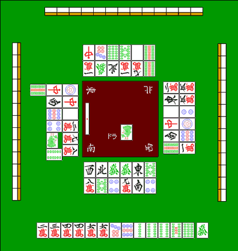

# 防守 2—安全牌

安全牌：  例如面对这样的立直，

切什么牌才不会放铳呢？

 日本麻雀中有一个原则：振听状态是不能够荣和的。 所以对手切掉的牌都是安全的。

上图的情况，就符合这个条件。
另外，立直之后所通过一次的牌都不能够荣和。  所以对家已经通过的 7 饼和下家通过的 5 万也是不能被荣和的牌。  像这些被振听规则规定不能荣和的明确的牌就叫做“现物”。  除了现物之外，还有其他 100%安全的牌。 那就是现在摸到的这张發。  由于场上已经切出了 3 张，不会有双碰和单骑听牌。 而且对手也不是国士无双，所以是一张完全安全牌。  完全安全牌有一下 4 种：  其他 3 人各自都切过一张的牌。（3 家现物）

上家刚刚切过的牌。（也是 3 家现物） 没有国士无双听牌时，第四张字牌。 完全的 NO CHANCE。   后面会进入“壁”的说明。  上图的例子的安全牌已经很充分了。想要避免放铳的话还是很容易的。 但是，安全牌不是什么时候都有的。 因此，“筋”和“壁”就比较重要了。   （待续）