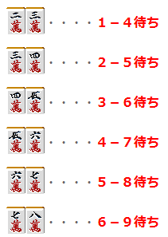
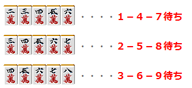
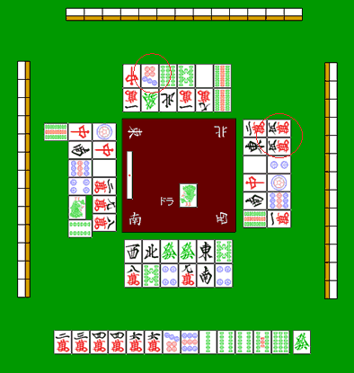

# 防守 3—筋（1）

筋 1：  有人立直的时候，最应该警戒的就要是两面听牌了。  只要对手不是麻将的初学者， 一般情况下都会等待嵌张、双碰听牌变化成两面听牌。  因为对手会等待嵌张和双碰听牌变化成两面的好形听牌， 所以听牌了也有可能不会立直。  因此立直的听牌形往往是两面居多， 大体的数据显示，所有的立直中三分之二的立直都是两面听牌。  为了不铳两面听牌的理论就叫做“筋”。

6 个基本筋

 我们来看看实际的两面听牌吧。

 以上六组就是两面听牌的所有形。这六组需要全部记住。 要记住这六组应该是非常容易的。

3 条筋

  看了上面的六组听牌， 我们可以发现，1-4 与 4-7、2-5 与 5-8、3-6 与 6-9 之间有相连的地方。 这样就可以推导出三面张的筋。

 把基本两面听牌组合起来就可以形成三面听牌。 正是因为这样，6 组基本的筋可以看作 3 条大筋。  1-4-7（一四七） 2-5-8（两五八） 3-6-9（三六九）

6 个筋分为 3 条大筋是非常重要的。 大家把筋的概念作为麻将的一个常识来记住吧。

根据筋我们能知道什么

  （1）自己切过自己所听的牌即会振听，不能荣和。 （2）麻将中的两面听牌只有六种（1-4、2-5、3-6、4-7、5-8、6-9）  由以上两点，我们就可以知道什么牌不会铳两面听牌。

 我们再来看看这个例子吧。  对家切 7 饼以及下家切的 5 万都通过了。 这就是通过“筋”得出的判断。  由于立直的上家切掉了 4 饼，所以至少他不是 56 饼的两面听牌，即使是也会振听。 所以切 7 饼至少不会铳两面听牌。  下家切的 5 万，是有 2、8 万所推导出的筋。

5 万虽然可以有 34 万和 67 万两面听牌荣和， 但是上家切掉了 2 万和 8 万，所以不管是 34 万还是 67 万都会振听。 因此 5 万也可以说是一张安全牌。   （待续）