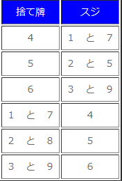
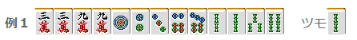
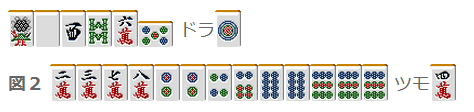

# 防守 4—筋（2）

筋 2：  我们来进一步说明麻将中非常重要的概念——筋。

远筋（半筋）？

 这是经常出现（貌似是吧）在新手中的一个误解。  比如：

 这个立直切掉了 6 万，所以 39 万就是筋 只要不是两面听牌，还多少是安全的。  但是，8 索通过了并不代表 25 索就是安全的。  这个“半筋”，经常看到有人切，其实是不靠谱的。 但是，与 8 索同一组筋的 5 索和无筋的 5 饼相比，危险度还是有差距的。  因为 5 饼有可能是 34 饼或者 67 饼形的听牌， 5 索已经排除了 67 索的听牌形，至少比 5 饼靠谱。  下面列出可靠筋的显示表，请确认清楚。

相对安全的筋

  【对手立直的手牌】

 我们看看这个立直，宝牌是 1 饼。 自己的手牌如例 1

 对手切掉了 6 万，所以，39 万是筋牌。那到底该打什么呢？  能和 3 万的听牌型就可能有，3 万单骑或者双碰，以及 12 万或者 24 万的边张嵌张。 能和 9 万的听牌型可能有，9 万单骑或者双碰。  没有边张、嵌张的可能，因此 9 万要比 3 万安全一点。 所以这里就切掉 9 万。  也许有人会想，真有人会单骑 3 万吗？

如果是这样的复合型就又可能了。

理论： 老头牌没听边张和嵌张听牌型，所以要比其他的筋更安全。

  【对手立直的手牌】

自己的手牌入图 2,2 饼和 8 饼就是筋牌。  2 饼的听牌型有 2 饼单骑、双碰以及 13 饼嵌张 8 饼的听牌型有 8 饼单骑、双碰以及 79 饼嵌张。  但是由于 4 张 9 饼已经都出现（包括宝牌表示牌），所以不会有嵌 8 饼的情况。 而且 1 饼是宝牌，所以嵌 2 饼也还是有可能的。 比如 135 饼，切 5 饼立直等等情况。  2 饼虽然作为“筋牌”是安全的，但是这里也是一张比较危险的牌。  所以图 2 的手牌应该切 8 饼。  理论： 宝牌周边的牌，即使是筋牌也是危险的。筋牌引挂的立直还是比较多的。   （待续）