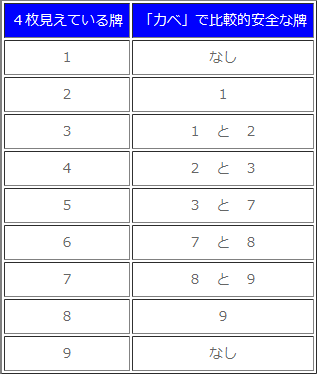
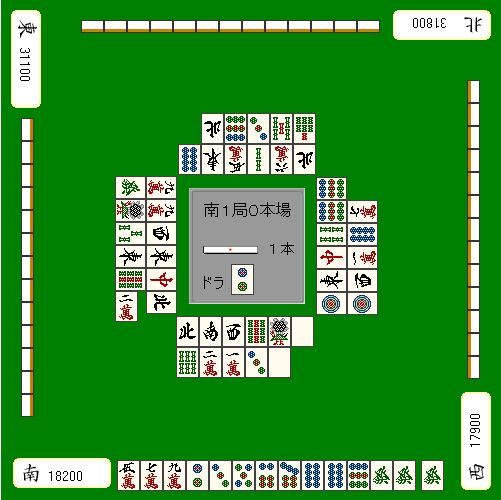

# 防守 5—壁

壁：  寻找比较安全的牌，还有一个手段就是“壁”。

NO CHANCE

 如果对手的听牌是1 4饼的话，

那么他至少有一张2饼和3饼。 因此，如果2饼和3饼4张都已经在场上了， 那么对手就绝对不可能听1 4饼。  因为麻将中相同的牌一共就只有4张，这是理所当然的。 那么1饼就是非常安全的。  不过需要注意的是，4饼并不是安全的 因为还有4 7饼听牌的可能。

ONE CHANCE

  特定的牌出现三张，就会出现 ONE CHANCE， 剩下的一张可能由立直的人拿着， 所以和 NO CHANCE 不同，ONE CHANCE 还是有铳两面听牌的可能的。  ONE CHANCE 在序盘的时候是可信的，但是千万不要忘了在终盘就不怎么靠谱了。  因为序盘能够见到3张的时候，还有一张很有可能在山牌里。 即使是 ONE CHANCE 可信度还是不错的。  但是到了终盘这个概率就比较低了。

 另外，比如立着者切3索立直。 由于立着者的现物容易被打出，有些 ONE CHANCE 是人为造成的。  特别是3人都弃和，还剩下最后一张3索没有出现。 剩下一张3索被立直者拿着的可能性非常高。  而且即使作为壁的1索一直没有出现的话， 双碰听牌也是需要考虑的。 即使是 NO CHANCE 也是需要注意的。  不管怎么说，ONE CHANCE 并不是那么靠谱的东西。
 理论： ONE CHANCE 在早巡是可信的， 但在终盘千万不要信。

双重 ONE CHANCE

这是 ONE CHANCE 的一个应用推导。  比如7饼和8饼场上都已经出现了三张。 对手要同时拿到唯一的一张7饼和8饼的概率是很低的，  这样的情况就叫做“双重 ONE CHANCE”，所以9饼是相当安全的牌。 安全度的比较是：NO CHANCE>双重 ONE CHANCE>>ONE CHANCE

壁的运用

 我们在实战中来利用壁寻找安牌吧。

 虽然这个牌切现物的9万也不错，不过还是切9饼吧。  场上已经见到四张8饼，所以不会有两面听牌。 况且四张9饼也都出现了，所以不会有双碰和单骑听牌。 当然除了国士无双之外是100%通过的。  （待续）